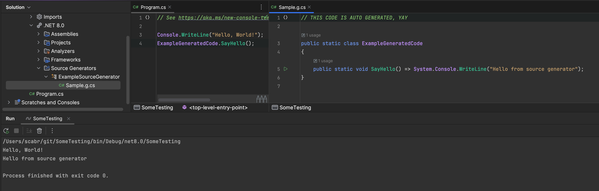

# {{ $frontmatter.title }}

## Преамбула:

Генераторы, так-то, фишка дотнетовская и, скорее всего, может захотеться использовать их для шаренного кода (клиент-сервер, например). И в какой-то момент появится необходимость определять, что код мы генерим в контексте юнити. Погнали разбираться.

## Как это работает:

Сорс генератор - это по сути микропрограмма, которая запускается при компиляции для каждой сборки в которую он установлен и сборок на нее ссылающихся.

Т.е. контекстом верхнего уровня будет являться компилируемая assembly - это либо csproj в контексте dotnet'a, либо asmdef \ Assembly-CSharp в контексте Unity.

При этом с точки зрения SG - это одинаковые дотнетовские сборки. Но нам надо как-то определять unity или нет, так что будем немного костылить и абъюзить юньковскую систему сборки, а точнее ее особенности.

Какие есть варианты:

* Компилить анализатор отдельно для юньки (или даже иметь отдельный)
    * Pros: изолированно и атомарно.
    * Cons: нужно обеспечить еще один уровень шаренного кода между генераторами.
* Универсальный геренатор
    * Pros: универсальный.
    * Cons: надо учитывать при поддержке, что есть два контекста выполнения.


Если с первым все понятно, то со вторым все не так уж просто - надо как-то понимать, что "мы в unity", так что рассказываю.

## Определяем, что "мы вошли":

Не буду томить - будем вытаскивать дефайны.

Юнька в каждую компилируемую сборку пропихивает дефайны вида `UNITY_EDITOR`, `UNITY_5_3_OR_NEWER` и т.д.

Добавляем в наш генератор следующие свойства:

```csharp
private bool IsUnity { get; set; }
private bool IsUnityEditor { get; set; }
```

и в методе Execute в самом начале первыми строчками добавляем следующий код:

```csharp
IsUnity = context.ParseOptions.PreprocessorSymbolNames.Any(define => define.Contains("UNITY"));
IsUnityEditor = context.ParseOptions.PreprocessorSymbolNames.Contains("UNITY_EDITOR");
```

Выглядит костыльненько, но, как показала практика, работает железобетонно.

> Вообще можно изи делать такие проверки дефайнов не только для юнити, но и для любых ваших настроек сборки хоть в рамках юнити, хоть в чистом dotnet.

Теперь подредачим сам генератор и посмотрим как это работает.

Метод Execute будет иметь следующий вид:

```csharp
public void Execute(GeneratorExecutionContext context)
{
    IsUnity = context.ParseOptions.PreprocessorSymbolNames.Any(define => define.Contains("UNITY"));
    IsUnityEditor = context.ParseOptions.PreprocessorSymbolNames.Contains("UNITY_EDITOR");

    var sb = new StringBuilder();
    sb.AppendLine("// THIS CODE IS AUTO GENERATED, YAY");
    sb.AppendLine();
    sb.AppendLine("public static class ExampleGeneratedCode");
    sb.AppendLine("{");
    if (IsUnity)
    {
        sb.AppendLine("\t[UnityEngine.RuntimeInitializeOnLoadMethod]");
        sb.AppendLine("\tpublic static void HelloSourceGenerators() => UnityEngine.Debug.Log(\"Hello from source generator\");");
    }
    else
    {
        sb.AppendLine("public static void SayHello() => System.Console.WriteLine(\"Hello from source generator\");");
    }
    sb.AppendLine("}");
    context.AddSource("Sample.g.cs", sb.ToString());
}
```

Билдим и смотрим в unity - там ничего не должно поменяться с прошлого поста.

## Тестим в дотнете

Создаем в консольку и линкуем туда наш генератор и добавляем в csproj ссылку на наш сорсгенератор:

```xml
<ItemGroup>
  <ProjectReference Include="[путь к проекту]\Packages\[название пакета]\src~\[название генератора].csproj" OutputItemType="Analyzer" ReferenceOutputAssembly="false"/>
</ItemGroup>
```

И вызываем наш сгенерированный метод:

```csharp
ExampleGeneratedCode.SayHello();
```

Ну и все работает:



Cheers, дальше будет больше.
```