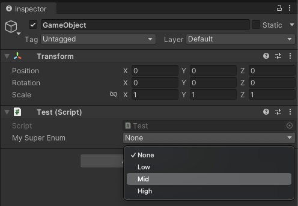

# {{ $frontmatter.title }}

## Нафига?

Юнька это content driven в двигло и очень многие вещи делаются на основе сериализованного контента. Эту особенность можно использовать и в сорс генераторах, например, для генерации кода по сконфигурированным в редакторе файлам.

Основа генератора - из предыдущих статей, в качестве примера будем генерировать енам. Погнали.

## Структура и флоу:

Задача - генерировать енам из какого-то сериализованного представления в сорс генераторе как в unity так и в чистом дотнете, это может быть json, бинарь или какой-то кастомный формат.

Для чистоты и понимания контекста енам будем генерировать по следующим правилам:

1. Исходник - текстовый файл с расширением .enum
2. Внутри перечислены значения по аналогии с .ini файлами - ИМЯ=ЗНАЧЕНИЕ.
3. Неймспейс должен соответствовать рут неймспейсу сборки.

Для этих целей идеально подходит механизм Additional Files о котором можно почитать [здесь](https://github.com/dotnet/roslyn/blob/main/docs/analyzers/Using%20Additional%20Files.md).

Файлик с нашим будущим енамом обзовем MySuperEnum.enum и наполиним следующим контентом:


Кстати уже можно начать использовать дотнетовскую SyntaxFactory чтоб не долбаться со стринг билдером и форматированием, так что добавим в юзинги вот такую строчку - она значительно облегчит жизнь:

`using static Microsoft.CodeAnalysis.CSharp.SyntaxFactory;`

И напишем еще один геренатор:

```csharp
using System.IO;
using System.Linq;
using Microsoft.CodeAnalysis;
using Microsoft.CodeAnalysis.CSharp.Syntax;
using static Microsoft.CodeAnalysis.CSharp.SyntaxFactory;
using SyntaxKind = Microsoft.CodeAnalysis.CSharp.SyntaxKind;

[Generator]
public class EnumSourceGenerator : ISourceGenerator
{
    public void Initialize(GeneratorInitializationContext context) { }

    public void Execute(GeneratorExecutionContext context)
    {
        // бежим по всем аддишнал файлам
        foreach (var additionalFile in context.AdditionalFiles)
        {
            // проверяем расширение
            if (Path.GetExtension(additionalFile.Path) != ".enum") continue;
            
            // вычитываем контент и подготавливаем переменные
            var values = File.ReadAllLines(additionalFile.Path)
                .Select(line => line.Split('='))
                .ToDictionary(line => line[0], line => line.Length > 1 ? int.Parse(line[1]) : (int?)null);
            var name = Path.GetFileNameWithoutExtension(additionalFile.Path);
            
            // генерируем код енама
            var enumValues = values.Select(kv =>
            {
                var (name, value) = (kv.Key, kv.Value);
                if (value.HasValue)
                    return EnumMemberDeclaration(name).WithEqualsValue(EqualsValueClause(
                        LiteralExpression(
                            SyntaxKind.NumericLiteralExpression,
                            Literal(value.Value))));

                return EnumMemberDeclaration(name);
            }).ToArray();

            // строим неймспейс, тип енама и его значения
            MemberDeclarationSyntax content = EnumDeclaration(name).AddMembers(enumValues);
            var namespaceName = context.Compilation.Assembly.NamespaceNames.FirstOrDefault(ns => !string.IsNullOrEmpty(ns));

            if (!string.IsNullOrEmpty(namespaceName)) // check namespace name
                content = NamespaceDeclaration(ParseName(namespaceName)).AddMembers(content);

            var root = CompilationUnit()
                .AddMembers(content)
                .WithLeadingTrivia(Comment("// THIS IS GENERATED ENUM. YAY"))
                .NormalizeWhitespace();
            
            context.AddSource($"{name}.g.cs", root.ToFullString());
        }
    }
}
```

С генератором закончили, поехали дальше.

## Интеграция в dotnet:

В дотнет проект добавляем наш enum файл и лезем в настройки. Открываем свойства и выбрираем в настройках Build Action -> AdditionalFiles вот так:


Генератор должен это все переварить и в выхлопе сорс генератора можем наблюдать наш енам:


> Стоит отметить что, например, Rider будет перегенеривать класс каждый раз когда мы меняем исходный файл.

## Интеграция в Unity:

С юнити немножко сложнее, потому что у нас нет как таковых файлов проекта, юнька генерит их сама и редачить их руками нет никакого смысла потому что при следующей компиляции они затрутся.

Но выход есть, и называется он csc.rsp. Это специальный механизм передачи внешних параметров в компилятор MSBuild.
Мы же будем прокидывать через него доп файлы.

Для этого в папке с проектом создадим файл csc.rsp со следующим содержимым:

`-additionalfile:"Assets/MySuperEnum.enum"`

Соответственно и файл с енамом должен у нас лежать в корне проекта.
Пути должны быть относительно рута проекта что не очень удобно, но решается кастомным ассет импортером.

Когда всё прочихается можем наблюдать наш енам в проекте юнити:


Использовать в наших скриптах:


И наблюдать в самой юнити:



Что с этим можно делать в перспективе? Да кучу всего на что хватит фантазии и терпения.
Всем Cheers!