::: warning
This post has been translated by artificial intelligence and needs proofreading.
:::

# {{ $frontmatter.title }}

> A post to summarize information and possibly help beginners understand the basic concepts.

To answer right away:

> Yes, I also decided to write my own ECS and even had a couple of attempts to start, but in one way or another, I ran into some limitations, so this time I will move thoroughly, step by step, and possibly even with feedback.

## What is ECS and how to use it

What does [Wikipedia](https://en.wikipedia.org/wiki/Entity_component_system) tell us:

> Entity component system (ECS) is a software architectural pattern mostly used in video game development for the representation of game world objects. An ECS comprises entities composed from components of data, with systems which operate on the components.
> ECS follows the principle of composition over inheritance, meaning that every entity is defined not by a type hierarchy, but by the components that are associated with it. Systems act globally over all entities which have the required components.
> Due to an ambiguity in the English language, however, a common interpretation of the name is that an ECS is a system comprising entities and components.

In short: *an architectural pattern where entities are compositions of components, whose logic is processed by systems*.

All ECS stuff is gathered into one heap, and this heap is called the world.

## World

World (or world) is a high-level abstraction, usually a class, aggregating many entities and systems that modify and manipulate entities within the context of the world.

The world often also has an external API allowing interaction with it from an external context - for example, creating entities upon user or network input.

The world is, you could say, a container for entities, components, and systems.

## Entity

Entities themselves are nothing without components - they cannot be processed by systems, they do not store user data (they can, but it's not canonical), and they do not have their own behavior.

In canonical ECS - these are just indices in a global array. In non-canonical - some abstract nobodies, something like your classmate you can't remember. In all cases - these are unique identifiers that uniquely define an entity in a specific world.

If in the context of the world the identifier represents nothing, then for the external context the very fact of the entity's existence may already have some significance (but more on that later).

Components are the building blocks from which an entity is constructed. It is the set of components that defines what the entity represents. At the same time, these building blocks contain only data describing the state of the entity, but do not contain logic.

> If it flies and quacks - then it's a duck.
> If there is a flying and quacking component - then it's also a duck.
> Two identical quacks in a duck cannot exist, it's either the same quack or different ones.

But components themselves cannot live independently, just as independent flying or quacking cannot exist. A component is a property of an entity, so they are stored together - the component is directly or indirectly linked to the entity's ID.

In the simplest version, data can be represented as a two-dimensional array or table, where each row is a component type, and each column is the index of our entity, something like this:



But as the number of entities grows and considering that not all components will be used on all entities, it will look more like this:



... the scale is reduced, but in a medium-complex project, this is a hundred or two types of components and several thousand entities.

> Very similar to a table in a relational DB with the only difference being that each cell is a separate data structure.
> But personally, it reminds me of a truth table. If you group them by existing components and detach from the grid - you can also stretch it to a subset in a set.
> I will return to truth tables and set theory more than once.

As you can see, the data is quite sparse, and storing it in a two-dimensional array will not be very efficient, especially considering that these will most likely be structures, not classes (both structures and classes can have different sizes, but it doesn't matter - since they will be stored somewhere randomly in the heap), and also of different sizes, but more on that later - now we are dealing with concepts.

In addition to storing data, it is also necessary to manipulate it - change, retrieve, filter, etc. In most frameworks, concepts such as Filter, Query, and System are used. Let's consider each in order:

## Filter / Query

Filters and queries are something like an SQL query `select entity from * where Component1 != null & Component2 != null & Component3 == null`, i.e., a mechanism for selecting a set of entities from all existing ones.

Usually implemented as an immutable class \ structure that morphs with extension methods and has a method returning **a subset of entities**.

For the filter described above, the match from the previous illustration would be entities 3 and 9.

> In fact, all this ECS stuff is very closely intertwined with Boolean algebra and set theory - I recommend [reading](https://plato.stanford.edu/ENTRIES/boolalg-math/) or [watching](https://www.youtube.com/playlist?list=PLTd6ceoshprcTJdg5AI6i2D2gZR5r8_Aw).

Filtering is mostly based on the presence or absence of a component, in rare cases - based on the component's data for two reasons:

1. The presence and absence of a component is tracked for other areas of ECS usage, including archetypes (more on them later).
2. To process the component's data, it is necessary to retrieve it, which can significantly impact performance with a large number of entities. Moreover, based on point 1 - information about the presence of a component can be stored separately from the data and in a different form, for example, in a bitmask.

> Some ECS implementations support in-place iteration over the filter without the need to save a subset of entities and iterate over it.

> In some frameworks, this is the only available mechanism to do something with entities en masse, besides direct references to the entities themselves.

## System

A system - in canonical ECS, is the logic of data manipulation described (ideally) as a static function taking references to specific components as arguments and not returning any values.

> The most interesting thing is that nowhere is it described whose responsibility it is to query entities and push them into systems. Such a design hole, in my opinion.
> Or maybe not a hole, just such a blurred pattern "store data like this, process it like this, and how you will marry one with the other - we don't really care."

In practice - usually, a system is an instance of a class implementing the ISystem interface with an Update method, which is passed into the world and stored in it. This solves a number of problems such as:

1. The order of system calls - is determined by the order of adding systems to the world.
2. Parameterization and dependency injection - input or some configs, for example.
3. Injection of internal dependencies - systems need to get references to component data somewhere, so usually, this is done by the systems themselves when added to the world (they get various pools and stashes to query them later).
4. The ability to "disable" systems - sometimes useful.

Systems rarely work with one type of component, more often - with a specific set, while some components act as input data, some as output - but these sets are not mutually exclusive.

> For example, to move an object in space, you need at least 2 components: Position and Velocity, where each of them can act as both input and output data - we get the current position and movement vector, add the vector * time to the position, subtract damping from the vector, for example.

> In complex cases, the number of components can reach a dozen or more - but such systems are better decomposed into more atomic ones.

## Archetype

The concept of an archetype was born out of the iteration problem (hello DOD).

When we have many entities with a large number of different combinations on them, it is efficient to "grind" through the system only if all the necessary components are nearby, and we simply take the necessary ones in a loop.

Hence the approach of "putting ducks with ducks, and apples with apples."

This approach allows processing both ducks and apples separately, as well as together if they are both edible.

From a technical point of view, an archetype is a subset of components based on composition. The illustration below clearly shows what the structure of a world using archetypes looks like:



More complex, scarier, but it allows iterating only over entities with the required set of components, ignoring others.

But there is also a price, direct access through an entity becomes burdened with extra accesses to various caches, mappings, sparse sets, etc., which negatively affects the performance of atomic operations.

> For example, if our system needs all entities with components 1 and 3, then the iteration will occur only over archetype 4.

> If by components 3 and 6 - over archetypes 1 and 4 respectively.

> If we want to get/change component 1 of entity 7, we need to:
> 1. Look into the archetype table and find which archetype this entity belongs to.
> 2. Look into the archetype and find under which index the data of this entity is stored.
> 3. Get/change the component itself by the index in the archetype.

## Aspect

There is also such a thing. Essentially, it is just a set of component types, a piece of an archetype, in short, a certain 'attribute' of an entity.

The simplest example would look something like this:
```csharp
struct PositionComponent {
  public float x, y, z;
}

struct RotationComponent {
  public float x, y, z;
}

struct ScaleComponent {
  public float x, y, z;
}

struct TransformAspect {
  public PositionComponent position;
  public RotationComponent rotation;
  public ScaleComponent scale;
}
```

At the same time, from the API point of view, it behaves like a component, you can also make selections, spin in systems, filter.
But 'under the hood' it is interpreted as a 'set of components'.

That's all for now, time to pee and sleep. I will stop at each stage in more detail later and examine and measure everything in detail.
