# {{ $frontmatter.title }}

::: warning
This post has been translated by artificial intelligence and needs proofreading.
:::

Currently, there are quite a few implementations of ECS frameworks, but they can be divided into several main categories.

1. Classic Mustaches - these are where all components of one type are stored in a separate isolated storage, and the Entity is an index to access a cell in this storage (either directly as an index or indirectly through some sparse set).
2. Trendy Mustaches - these are where the storage of components is based on archetypes, i.e., components are grouped by (conditional) entity type, which is determined by the set of components it owns.
3. Extravagant Mustaches - this is when components are scattered across the heap, both approaches are used, aspects or some other special non-standard way of handling everything.

But let's discuss each in order.

## Classic ECS

Here everything is as simple as possible - in the minimal implementation, ECS will look something like this:

<details>
    <summary>World.cs</summary>

> An example of usage can be found [here](https://github.com/blackbone/ecs/tree/main/ecs1)

```csharp
public class World : IWorld<int>
{
    private struct ComponentWithFlag<T>
    {
        public bool flag;
        public T component;
    }

    private readonly Queue<int> freeEntityIds = new();
    private readonly Dictionary<Type, Array> components = new();
    
    private bool[] isAlive;

    public World(int entityCount = 256) => Resize(entityCount);

    private void Resize(in int size)
    {
        var initialSize = isAlive?.Length ?? 0;
        if (initialSize >= size) return;

        Array.Resize(ref isAlive, size);
        foreach (var (key, componentStorage) in components)
        {
            var newArray = Array.CreateInstance(componentStorage.GetType().GetElementType()!, size);
            componentStorage.CopyTo(newArray, componentStorage.Length);
            components[key] = componentStorage;
        }
        
        for (var i = initialSize; i < size; i++)
            freeEntityIds.Enqueue(i);
    }

    // CRUD [C]reate :: world
    public int CreateEntity()
    {
        if (freeEntityIds.Count == 0) Resize(isAlive.Length + 32);
        var entity = freeEntityIds.Dequeue();
        isAlive[entity] = true;
        return entity;
    }

    // CRUD [D]elete :: world
    public void DeleteEntity(in int entity) => isAlive[entity] = false;

    // CRUD [C]reate :: entity
    public void AddComponent<T>(in int entityId, in T c)
    {
        ComponentWithFlag<T>[] storage;
        if (components.TryGetValue(typeof(T), out var array)) storage = (ComponentWithFlag<T>[])array;
        else components[typeof(T)] = storage = new ComponentWithFlag<T>[isAlive.Length];
        
        if (storage[entityId].flag) throw new Exception($"Entity {entityId} already has {typeof(T)}");
        storage[entityId] = new ComponentWithFlag<T> { flag = true, component = c };
    }

    // CRUD [R]ead/[U]pdate :: entity
    public ref T GetComponent<T>(in int entityId)
    {
        ComponentWithFlag<T>[] storage;
        if (components.TryGetValue(typeof(T), out var array)) storage = (ComponentWithFlag<T>[])array;
        else components[typeof(T)] = storage = new ComponentWithFlag<T>[isAlive.Length];
        
        if (!storage[entityId].flag) throw new Exception($"Entity {entityId} has no {typeof(T)}");
        return ref storage[entityId].component;
    }

    // CRUD [D]elete :: entity
    public void DeleteComponent<T>(in int entityId)
    {
        ComponentWithFlag<T>[] storage;
        if (components.TryGetValue(typeof(T), out var array)) storage = (ComponentWithFlag<T>[])array;
        else components[typeof(T)] = storage = new ComponentWithFlag<T>[isAlive.Length];

        if (!storage[entityId].flag) throw new Exception($"Entity {entityId} has no {typeof(T)}");
        storage[entityId].flag = false;
        freeEntityIds.Enqueue(entityId);
    }
}
```

</details>

::: info
I specifically did not implement systems, filters, and other things, simply because this post discusses the structure of the world as such.

Also, I did not add code to reduce the size just so it doesn't take up extra space, it's not important for understanding the context.
:::

And in the form of a diagram, it looks something like this:



Here you can immediately notice a number of problems:

### Ambiguity of Entity Identification

If you save the index of a created entity in one part of the program and delete and create a new one in another, the old pointer to the entity will remain valid, which can lead to errors in user code.

We can't keep incrementing the index because component storages will eventually consume all the memory.

### Poor Utilization of Component Storages

Arrays are resized based on the number of entities - with a large number of entities and components and low utilization, memory will be wasted.

For example, in a world with 1,000,000 entities and 100 types of components with an average size of 16 bytes each (4 floats) - the amount of allocated memory for such a set will be 1,000,000 * 100 * 16 = 1,600,000,000 bytes or 1.6GB just for storing components.

But as I [wrote earlier](/posts/ecs/1/#entity) - component utilization is often very sparse, and in the best case, an average of 2-3-5, even 10 components will be used per entity, which will be only 10% of the used memory (or 160MB) - which is a significant difference.

### Fragmentation of Storages

When components are deleted, holes will inevitably form, i.e., allocated array elements that are not used.

But this problem only arises when using sparse sets or some other method of virtual addressing (when the actual entity id is translated into a local index within the storage).

### Layout Not Optimal for Reading

Usually, the user works with several components simultaneously - adds velocity to position or subtracts hp based on the value from currentDamageComponent (previously recorded from somewhere else), and so on.

The components themselves are elements of arrays that lie in different parts of the heap, and for efficient processing, they need to be "dragged" to the CPU transistors - and this will be a [cache miss](https://en.wikipedia.org/wiki/CPU_cache#Cache_miss) in 99% of cases.

This is expensive and one of the reasons why "doing a lot of calculations" - "lags", perhaps even the main one.

But we will return to this later.

---

Nevertheless, this is what classic mustaches look like "under the hood", or at least it was intended to be this way.

## Archetypal ECS

Already more complex, I certainly won't write explanatory code, but I will make a diagram.

It will look similar to what I drew in the [previous article](/posts/ecs/1/#archetype):


Why are there two pictures? Because there are also two main approaches to implementation: [SoA and AoS](https://en.wikipedia.org/wiki/AoS_and_SoA). We won't go into detail, just note the difference:

`world-1` - SoA approach. For each type of component within the archetype, there is a separate array or any other linear storage.

> In memory, elements within the archetype are arranged as `c1, c1, c1, c1, ...`, `c2, c2, c2, ...`, `c3, c3, c3, ...`

`world-2` - AoS approach. Each archetype contains 1 array, the elements of which are composites of entities (c1, c2, c3).

> In memory, elements within the archetype are arranged as `c1, c2, c3, c1, c2, c3, c1, c2, c3, ....`

As you can see, there are no holes in either case, and if you calculate a similar layout (by the way, pictures 1 and 2 depict two identical worlds in different ECS paradigms) - it turns out that memory is used much more efficiently.

> For example, in both cases, 33 instances of the component are used (at 4 bytes each, this will be 132 bytes), in classic mustaches, a whole 352 bytes are allocated for this (I did not count the empty 7th component).

It would seem - the perfect solution, but no - this approach is also not free from problems:

### Structural Changes

Suppose we want to add or remove an entity component - in a classic ECS this would be an atomic operation, we would simply dive into the necessary array and remove it.

In archetypal ECS, however, we have to extract the entity from the archetype, remove it from there, modify it (add or remove a component), calculate the new archetype, and add the modified entity to it.

Costly, right? - Yes! Structural changes in archetypal ECS are very expensive, especially when entities have large sets of large components.
This is why many implementations of archetypal ECS offer the ability to 'disable' a component.

### Fragmented Memory

When there are many archetypes in the world and few entities of different archetypes (conditionally all entities are different) - they will be stored in different memory areas, which will result in the same [cache misses](https://en.wikipedia.org/wiki/CPU_cache#Cache_miss) during processing.

Just imagine that we have 100 entities in the world, all with different sets of components, but not entirely different. All have `Position`, `Rotation`, `Mesh`, `Material`, and some other common basics. It would be nice to process everything that moves in one place and quickly.
But each of these entities will lie in a separate archetype somewhere in a random place in the heap, so [data locality](http://gameprogrammingpatterns.com/data-locality.html) cannot be utilized, and we will constantly jump around the heap.

### Complex Structure

Compared to the classic implementation, many additional inputs appear that need to be monitored: what archetype the entity has, what it will become with structural changes, under what index in which archetype the entity data is located, and so on.

All this imposes computational costs, which generally slow down the system's performance.

## Extravagant Solutions

I won't go into detail, but there are 'other' approaches that allow, for example, *attaching a script to an entity* or *attaching one instance of a component to several entities*, using singletons.
> In general, such solutions should be avoided unless they solve your specific problem.

## Conclusions

There will be no any. Just figuring out how all this works.