# {{ $frontmatter.title }}

::: warning
This post has been translated by artificial intelligence and needs proofreading.
:::

## The Essence of the Problem

As I previously wrote [here](/posts/ecs/2/#classic-ecs) - naively using EntityId as an index in component storage is not very efficient, although it is the fastest access method (excluding resizes, of course). Unused occupied memory, in practice, will tend to 100% as the number of entity types grows, and I am not the first to think about this.

The most obvious solution would be to store components in a dictionary: Dictionary<entityId(int), data(TComponent)>.
Simple - yes, O(1) - yes, efficient - no, components will be scattered across the heap, and there will be a lot of "heap jumps" and cache misses. Not very good.

## Expected Result

Here, it is probably worth describing what solution we should strive for and what we want to achieve in the end.

So, the expected result:
1. Access to elements in O(1) for both reading and writing.
2. Linear arrangement of elements in memory.
3. Minimal overhead on element insertion/deletion.

Desired API:
> Don't forget about CRUD

```csharp
interface IStorage<T>
{
    int Count { get; }

    ReadOnlySpan<T> All();
    ReadOnlySpan<int> AllEntities();

    // [C]reate
    void Add(in int entityIid, in T value);

    // [R]ead
    bool Has(in int entityIid);

    // [R]ead/[U]pdate
    ref T Ref(in int entityIid);

    // [D]elete
    void Remove(in int entityIid);
}
```

<div class="info custom-block">

Additionally, `Count`, `All()`, and `AllEntities()` are added because it is a common practice to iterate over existing data. Just remember that they need to be exposed.

</div>

<div class="warning custom-block">

In all examples, `int` is used as the Entity Internal Identifier or entityIid in my examples
[used](https://github.com/blackbone/ecs/blob/103a52467314b7c9b82c67dda18d4ed9b08e87df/ecs2/EntityId.cs#L10) - in other frameworks, it could be a different data type, it's not essential.

What's essential is that EntityId is not used in its entirety here, and checks for world membership and whether the entity is alive or not are not implemented - 
these checks are performed at a higher level, and this element of the system is a so-called
[**hot spot**](https://en.wikipedia.org/wiki/Hot_spot_(computer_programming)) or **hot path** - a very high-load element of the system where even the most innocuous check can significantly degrade performance - *the fastest code is the code that isn't there*.

</div>

As a starting point, let's build on a basic "sparse" linear implementation:

```csharp
class Storage<T> : IStorage<T>
{
    private bool[]? has;
    private T[]? data;

    public int Count { get; private set; }
    public ReadOnlySpan<T> All() => throw new NotImplementedException();
    public ReadOnlySpan<int> AllEntities() => throw new NotImplementedException();

    public Storage() => Resize(32);
    
    public void Add(in int entityIid, in T value)
    {
        if (entityIid >= has!.Length) Resize((entityIid / 32 + 1) * 32);

        data![entityIid] = value;
        has![entityIid] = true;
        Count++;
    }

    public bool Has(in int entityIid) => entityIid < has!.Length && has[entityIid];

    public ref T Ref(in int entityIid) => ref data![entityIid];

    public void Remove(in int entityIid)
    {
        if (entityIid >= has!.Length) return;

        has[entityIid] = false;
        Count--;
    }

    private void Resize(in int size)
    {
        if (has == null)
        {
            has = new bool[size];
            data = new T[size];
            return;
        }

        var initialSize = has!.Length;
        if (initialSize >= size) return;
        
        Array.Resize(ref has, size);
        Array.Resize(ref data, size);
    }
}
```

As you can see, there is no efficient way to implement `All()` and `AllEntities()` with the current API, either through `IEnumerator` or by allocating a new array, both options are unacceptable, so we won’t dwell on them for now.

In the current implementation, `entityIid` itself is the index in the `data` array, which is very convenient but inefficient - still gaps.

To get rid of the gaps, you need to shift the array elements to the left, something like this:


Compact - yes, but something broke - also yes: now `entityIid` does not point to the correct element in the `data` array. In simple mathematical terms:

Was:   c<sub>e</sub> = data[i<sub>e</sub>]

Became:  c<sub>e</sub> = data[i<sub>с</sub>] where i<sub>с</sub> = *f*(i<sub>e</sub>) or simply c<sub>e</sub> = data[*f*(i<sub>e</sub>)]

> What is *f*()? Where did it come from?

*f*() is a function that transforms `entityIid` into an internal index within the `data` array. This is what was done with the elements in the animation above: took the index
that matched `entityIid` and changed it to another one, ensuring the elements are closely packed in the array.

In reality, it's not feasible to express this through a function simply because these changes depend on user code and are not deterministic,
but it can be expressed through mapping, storing the pair `entityIid` -> `index`.

> You can use Dictionary here!

You can, but we won’t because there’s a better option.

## Sparse Set

Explained [here](https://www.geeksforgeeks.org/sparse-set/) and [here](https://skypjack.github.io/2019-09-25-ecs-baf-part-5/), so I won't go into much depth.

In a nutshell - it's a clever mapping with addition, reading, writing, and deletion in O(n) but with certain limitations, namely:
- It can only store values in the range [0 : n), where n is the maximum number of elements.
- Will be sparse instead of our data array (this is acceptable in principle)

How it looks schematically:


We got rid of the gaps in the component storage, components lie linearly, is that all? - No, not all.

Assuming that we have figured out how it all fits together and is interconnected, let's look at the code:

Generally, the code will have the following appearance:

```csharp
class Storage<T> : IStorage<T>
{
    private int[]? sparse;
    private int[]? dense;
    private T[]? data;

    public int Count { get; private set; }
    public ReadOnlySpan<T> All() => new(data, 0, Count);

    public Storage() => Resize(32, 32);

    public bool Has(in int entityIid) => sparse![entityIid] != -1;

    public ref T Ref(in int entityIid) => ref data![sparse![entityIid]];

    private void Resize(in int sparseSize, in int dataSize)
    {
        if (sparse == null)
        {
            sparse = new int[sparseSize];
            dense = new int[sparseSize];
            Array.Fill(dense, -1);
            Array.Fill(sparse, -1);
            data = new T[dataSize];
            return;
        }
        
        var initialSparseSize = sparse!.Length;
        if (initialSparseSize < sparseSize)
        {
            Array.Resize(ref sparse, sparseSize);
            Array.Resize(ref dense, sparseSize);
            Array.Fill(sparse, -1, initialSparseSize, sparseSize - initialSparseSize);
            Array.Fill(dense, -1, initialSparseSize, sparseSize - initialSparseSize);
        }

        var initialDataSize = data!.Length;
        if (initialDataSize < dataSize)
            Array.Resize(ref data, dataSize);
    }

    public ReadOnlySpan<int> AllEntities() => throw new NotImplementedException(); // <-- ignoring for now
    public void Add(in int entityIid, in T value) => throw new NotImplementedException(); // <-- will solve below
    public void Remove(in int entityIid) => throw new NotImplementedException(); // <-- will also solve solve below
}
```

This code takes into account that the components are already in place and packed tightly. The `AllEntities()` method signature is questionable because
identifiers will never be packed tightly in `sparse`. We will deal with addition and deletion.

> I had doubts about the economy and efficiency of this approach, so I armed myself with a calculator and Google spreadsheets.

<details class="info custom-block">
    <summary><b>There is one theory, and now we will test it</b></summary>

With low component utilization, a large number of entities, and small component sizes, we **do not** save memory,
and we also add additional operations that complicate reading/writing.

Well, this needs to be checked, determine the following values and ranges:
1. **N**: Total number of entities - let's say 100,000.
2. **C**: Component size in bytes (sizeof, assuming align = 8 and the minimum component size is also 8, step - also 8).
3. **U**: Utilization [0:1] with a step of 0.1 (10%) - what % of all entities have this component, i.e., has value.

For a simple linear storage, the amount of memory consumption is calculated as *`(C + 1) * N`*. `U` is not taken into account because we allocate memory potentially
for all possible entities.

In reality, since we are obsessed with optimization, for linear implementation, memory consumption can be reduced using a bitmask, and the formula would look like
*`C * N + ceil(N / 8)`* - i.e., 1 byte for every 8 entities.

For storage with a sparse set, it will be *`sizeof(int) * 2 * N + C * N * U`*.

The table with calculations and the chart can be viewed here, along with the conclusions.
The vertical axis - component size

The horizontal axis - utilization

Number of entities - `1000`


<style>
    .measures tr:nth-child(1) td:nth-child(3) { background: #f005; }
    .measures tr:nth-child(1) td:nth-child(4) { background: #f005; }
    .measures tr:nth-child(1) td:nth-child(5) { background: #f005; }
    .measures tr:nth-child(1) td:nth-child(6) { background: #f005; }
    .measures tr:nth-child(1) td:nth-child(7) { background: #f005; }
    .measures tr:nth-child(1) td:nth-child(8) { background: #f005; }
    .measures tr:nth-child(1) td:nth-child(9) { background: #f005; }
    .measures tr:nth-child(1) td:nth-child(10) { background: #f005; }
    .measures tr:nth-child(1) td:nth-child(11) { background: #f005; }
    .measures tr:nth-child(1) td:nth-child(12) { background: #f005; }

    .measures tr:nth-child(2) td:nth-child(3) { background: #0f05; }
    .measures tr:nth-child(2) td:nth-child(4) { background: #0f05; }
    .measures tr:nth-child(2) td:nth-child(5) { background: #0f05; }
    .measures tr:nth-child(2) td:nth-child(6) { background: #0f05; }
    .measures tr:nth-child(2) td:nth-child(7) { background: #0f05; }
    .measures tr:nth-child(2) td:nth-child(8) { background: #f005; }
    .measures tr:nth-child(2) td:nth-child(9) { background: #f005; }
    .measures tr:nth-child(2) td:nth-child(10) { background: #f005; }
    .measures tr:nth-child(2) td:nth-child(11) { background: #f005; }
    .measures tr:nth-child(2) td:nth-child(12) { background: #f005; }

    .measures tr:nth-child(3) td:nth-child(3) { background: #0f05; }
    .measures tr:nth-child(3) td:nth-child(4) { background: #0f05; }
    .measures tr:nth-child(3) td:nth-child(5) { background: #0f05; }
    .measures tr:nth-child(3) td:nth-child(6) { background: #0f05; }
    .measures tr:nth-child(3) td:nth-child(7) { background: #0f05; }
    .measures tr:nth-child(3) td:nth-child(8) { background: #0f05; }
    .measures tr:nth-child(3) td:nth-child(9) { background: #f005; }
    .measures tr:nth-child(3) td:nth-child(10) { background: #f005; }
    .measures tr:nth-child(3) td:nth-child(11) { background: #f005; }
    .measures tr:nth-child(3) td:nth-child(12) { background: #f005; }

    .measures tr:nth-child(4) td:nth-child(3) { background: #0f05; }
    .measures tr:nth-child(4) td:nth-child(4) { background: #0f05; }
    .measures tr:nth-child(4) td:nth-child(5) { background: #0f05; }
    .measures tr:nth-child(4) td:nth-child(6) { background: #0f05; }
    .measures tr:nth-child(4) td:nth-child(7) { background: #0f05; }
    .measures tr:nth-child(4) td:nth-child(8) { background: #0f05; }
    .measures tr:nth-child(4) td:nth-child(9) { background: #0f05; }
    .measures tr:nth-child(4) td:nth-child(10) { background: #f005; }
    .measures tr:nth-child(4) td:nth-child(11) { background: #f005; }
    .measures tr:nth-child(4) td:nth-child(12) { background: #f005; }

    .measures tr:nth-child(5) td:nth-child(3) { background: #0f05; }
    .measures tr:nth-child(5) td:nth-child(4) { background: #0f05; }
    .measures tr:nth-child(5) td:nth-child(5) { background: #0f05; }
    .measures tr:nth-child(5) td:nth-child(6) { background: #0f05; }
    .measures tr:nth-child(5) td:nth-child(7) { background: #0f05; }
    .measures tr:nth-child(5) td:nth-child(8) { background: #0f05; }
    .measures tr:nth-child(5) td:nth-child(9) { background: #0f05; }
    .measures tr:nth-child(5) td:nth-child(10) { background: #0f05; }
    .measures tr:nth-child(5) td:nth-child(11) { background: #f005; }
    .measures tr:nth-child(5) td:nth-child(12) { background: #f005; }

    .measures tr:nth-child(6) td:nth-child(3) { background: #0f05; }
    .measures tr:nth-child(6) td:nth-child(4) { background: #0f05; }
    .measures tr:nth-child(6) td:nth-child(5) { background: #0f05; }
    .measures tr:nth-child(6) td:nth-child(6) { background: #0f05; }
    .measures tr:nth-child(6) td:nth-child(7) { background: #0f05; }
    .measures tr:nth-child(6) td:nth-child(8) { background: #0f05; }
    .measures tr:nth-child(6) td:nth-child(9) { background: #0f05; }
    .measures tr:nth-child(6) td:nth-child(10) { background: #0f05; }
    .measures tr:nth-child(6) td:nth-child(11) { background: #f005; }
    .measures tr:nth-child(6) td:nth-child(12) { background: #f005; }

    .measures tr:nth-child(7) td:nth-child(3) { background: #0f05; }
    .measures tr:nth-child(7) td:nth-child(4) { background: #0f05; }
    .measures tr:nth-child(7) td:nth-child(5) { background: #0f05; }
    .measures tr:nth-child(7) td:nth-child(6) { background: #0f05; }
    .measures tr:nth-child(7) td:nth-child(7) { background: #0f05; }
    .measures tr:nth-child(7) td:nth-child(8) { background: #0f05; }
    .measures tr:nth-child(7) td:nth-child(9) { background: #0f05; }
    .measures tr:nth-child(7) td:nth-child(10) { background: #0f05; }
    .measures tr:nth-child(7) td:nth-child(11) { background: #f005; }
    .measures tr:nth-child(7) td:nth-child(12) { background: #f005; }

    .measures tr:nth-child(8) td:nth-child(3) { background: #0f05; }
    .measures tr:nth-child(8) td:nth-child(4) { background: #0f05; }
    .measures tr:nth-child(8) td:nth-child(5) { background: #0f05; }
    .measures tr:nth-child(8) td:nth-child(6) { background: #0f05; }
    .measures tr:nth-child(8) td:nth-child(7) { background: #0f05; }
    .measures tr:nth-child(8) td:nth-child(8) { background: #0f05; }
    .measures tr:nth-child(8) td:nth-child(9) { background: #0f05; }
    .measures tr:nth-child(8) td:nth-child(10) { background: #0f05; }
    .measures tr:nth-child(8) td:nth-child(11) { background: #f005; }
    .measures tr:nth-child(8) td:nth-child(12) { background: #f005; }

    .measures tr:nth-child(9) td:nth-child(3) { background: #0f05; }
    .measures tr:nth-child(9) td:nth-child(4) { background: #0f05; }
    .measures tr:nth-child(9) td:nth-child(5) { background: #0f05; }
    .measures tr:nth-child(9) td:nth-child(6) { background: #0f05; }
    .measures tr:nth-child(9) td:nth-child(7) { background: #0f05; }
    .measures tr:nth-child(9) td:nth-child(8) { background: #0f05; }
    .measures tr:nth-child(9) td:nth-child(9) { background: #0f05; }
    .measures tr:nth-child(9) td:nth-child(10) { background: #0f05; }
    .measures tr:nth-child(9) td:nth-child(11) { background: #f005; }
    .measures tr:nth-child(9) td:nth-child(12) { background: #f005; }

    .measures tr:nth-child(10) td:nth-child(3) { background: #0f05; }
    .measures tr:nth-child(10) td:nth-child(4) { background: #0f05; }
    .measures tr:nth-child(10) td:nth-child(5) { background: #0f05; }
    .measures tr:nth-child(10) td:nth-child(6) { background: #0f05; }
    .measures tr:nth-child(10) td:nth-child(7) { background: #0f05; }
    .measures tr:nth-child(10) td:nth-child(8) { background: #0f05; }
    .measures tr:nth-child(10) td:nth-child(9) { background: #0f05; }
    .measures tr:nth-child(10) td:nth-child(10) { background: #0f05; }
    .measures tr:nth-child(10) td:nth-child(11) { background: #0f05; }
    .measures tr:nth-child(10) td:nth-child(12) { background: #f005; }

    .measures tr:nth-child(11) td:nth-child(3) { background: #0f05; }
    .measures tr:nth-child(11) td:nth-child(4) { background: #0f05; }
    .measures tr:nth-child(11) td:nth-child(5) { background: #0f05; }
    .measures tr:nth-child(11) td:nth-child(6) { background: #0f05; }
    .measures tr:nth-child(11) td:nth-child(7) { background: #0f05; }
    .measures tr:nth-child(11) td:nth-child(8) { background: #0f05; }
    .measures tr:nth-child(11) td:nth-child(9) { background: #0f05; }
    .measures tr:nth-child(11) td:nth-child(10) { background: #0f05; }
    .measures tr:nth-child(11) td:nth-child(11) { background: #0f05; }
    .measures tr:nth-child(11) td:nth-child(12) { background: #f005; }

    .measures tr:nth-child(12) td:nth-child(3) { background: #0f05; }
    .measures tr:nth-child(12) td:nth-child(4) { background: #0f05; }
    .measures tr:nth-child(12) td:nth-child(5) { background: #0f05; }
    .measures tr:nth-child(12) td:nth-child(6) { background: #0f05; }
    .measures tr:nth-child(12) td:nth-child(7) { background: #0f05; }
    .measures tr:nth-child(12) td:nth-child(8) { background: #0f05; }
    .measures tr:nth-child(12) td:nth-child(9) { background: #0f05; }
    .measures tr:nth-child(12) td:nth-child(10) { background: #0f05; }
    .measures tr:nth-child(12) td:nth-child(11) { background: #0f05; }
    .measures tr:nth-child(12) td:nth-child(12) { background: #f005; }

    .measures tr:nth-child(13) td:nth-child(3) { background: #0f05; }
    .measures tr:nth-child(13) td:nth-child(4) { background: #0f05; }
    .measures tr:nth-child(13) td:nth-child(5) { background: #0f05; }
    .measures tr:nth-child(13) td:nth-child(6) { background: #0f05; }
    .measures tr:nth-child(13) td:nth-child(7) { background: #0f05; }
    .measures tr:nth-child(13) td:nth-child(8) { background: #0f05; }
    .measures tr:nth-child(13) td:nth-child(9) { background: #0f05; }
    .measures tr:nth-child(13) td:nth-child(10) { background: #0f05; }
    .measures tr:nth-child(13) td:nth-child(11) { background: #0f05; }
    .measures tr:nth-child(13) td:nth-child(12) { background: #f005; }

    .measures tr:nth-child(14) td:nth-child(3) { background: #0f05; }
    .measures tr:nth-child(14) td:nth-child(4) { background: #0f05; }
    .measures tr:nth-child(14) td:nth-child(5) { background: #0f05; }
    .measures tr:nth-child(14) td:nth-child(6) { background: #0f05; }
    .measures tr:nth-child(14) td:nth-child(7) { background: #0f05; }
    .measures tr:nth-child(14) td:nth-child(8) { background: #0f05; }
    .measures tr:nth-child(14) td:nth-child(9) { background: #0f05; }
    .measures tr:nth-child(14) td:nth-child(10) { background: #0f05; }
    .measures tr:nth-child(14) td:nth-child(11) { background: #0f05; }
    .measures tr:nth-child(14) td:nth-child(12) { background: #f005; }

    .measures tr:nth-child(15) td:nth-child(3) { background: #0f05; }
    .measures tr:nth-child(15) td:nth-child(4) { background: #0f05; }
    .measures tr:nth-child(15) td:nth-child(5) { background: #0f05; }
    .measures tr:nth-child(15) td:nth-child(6) { background: #0f05; }
    .measures tr:nth-child(15) td:nth-child(7) { background: #0f05; }
    .measures tr:nth-child(15) td:nth-child(8) { background: #0f05; }
    .measures tr:nth-child(15) td:nth-child(9) { background: #0f05; }
    .measures tr:nth-child(15) td:nth-child(10) { background: #0f05; }
    .measures tr:nth-child(15) td:nth-child(11) { background: #0f05; }
    .measures tr:nth-child(15) td:nth-child(12) { background: #f005; }

    .measures tr:nth-child(16) td:nth-child(3) { background: #0f05; }
    .measures tr:nth-child(16) td:nth-child(4) { background: #0f05; }
    .measures tr:nth-child(16) td:nth-child(5) { background: #0f05; }
    .measures tr:nth-child(16) td:nth-child(6) { background: #0f05; }
    .measures tr:nth-child(16) td:nth-child(7) { background: #0f05; }
    .measures tr:nth-child(16) td:nth-child(8) { background: #0f05; }
    .measures tr:nth-child(16) td:nth-child(9) { background: #0f05; }
    .measures tr:nth-child(16) td:nth-child(10) { background: #0f05; }
    .measures tr:nth-child(16) td:nth-child(11) { background: #0f05; }
    .measures tr:nth-child(16) td:nth-child(12) { background: #f005; }
</style>
<div class="measures">

| Size | **LINEAR** | 0.1 | 0.2 | 0.3 | 0.4| 0.5 | 0.6  | 0.7 | 0.8 | 0.9 | 1 |
|---|---|---|---|---|---|---|---|---|---|---|---|
| 8 | **8125** | 8800 | 9600 | 10400 | 11200 | 12000 | 12800 | 13600 | 14400 | 15200 | 16000 |
| 16 | **16125** | 9600 | 11200 | 12800 | 14400 | 16000 | 17600 | 19200 | 20800 | 22400 | 24000 |
| 24 | **14125** | 10400 | 12800 | 15200 | 17600 | 20000 | 22400 | 24800 | 27200 | 29600 | 32000 |
| 32 | **32125** | 11200 | 14400 | 17600 | 20800 | 24000 | 27200 | 30400 | 33600 | 36800 | 40000 |
| 40 | **40125** | 12000 | 16000 | 20000 | 24000 | 28000 | 32000 | 36000 | 40000 | 44000 | 48000 |
| 48 | **48125** | 12800 | 17600 | 22400 | 27200 | 32000 | 36800 | 41600 | 46400 | 51200 | 56000 |
| 56 | **56125** | 13600 | 19200 | 24800 | 30400 | 36000 | 41600 | 47200 | 52800 | 58400 | 64000 |
| 64 | **64125** | 14400 | 20800 | 27200 | 33600 | 40000 | 46400 | 52800 | 59200 | 65600 | 72000 |
| 72 | **72125** | 15200 | 22400 | 29600 | 36800 | 44000 | 51200 | 58400 | 65600 | 72800 | 80000 |
| 80 | **80125** | 16000 | 24000 | 32000 | 40000 | 48000 | 56000 | 64000 | 72000 | 80000 | 88000 |
| 88 | **88125** | 16800 | 25600 | 34400 | 43200 | 52000 | 60800 | 69600 | 78400 | 87200 | 96000 |
| 96 | **96125** | 17600 | 27200 | 36800 | 46400 | 56000 | 65600 | 75200 | 84800 | 94400 | 104000 |
| 104 | **104125** | 18400 | 28800 | 39200 | 49600 | 60000 | 70400 | 80800 | 91200 | 101600 | 112000 |
| 112 | **112125** | 19200 | 30400 | 41600 | 52800 | 64000 | 75200 | 86400 | 97600 | 108800 | 120000 |
| 120 | **120125** | 20000 | 32000 | 44000 | 56000 | 68000 | 80000 | 92000 | 104000 | 116000 | 128000 |
| 128 | **128125** | 20800 | 33600 | 46400 | 59200 | 72000 | 84800 | 97600 | 110400 | 123200 | 136000 |

</div>

One can notice that the use of sparse sets in terms of memory consumption is not advantageous in two cases:
- Very small components.
- Very dense utilization.

<div class="warning custom-block">

Do not abuse splitting components into sparse-set ECSes, you will just waste memory for the sake of a false optimization.

</div>

</details>

## Addition / Deletion

The methods of addition and deletion are closely related, so, as always, a bit of theory.

There are several memory utilization strategies in linear storage systems such as arrays, and each of them needs to be understood, choosing something suitable.
> Let me clarify right away that there is no ideal strategy - each has its pros and cons.

### List Approach

Here, in general, everything is simple:

::: code-group

```csharp [Add]
public void Add(in int entityIid, in T value)
{
    // убедились, что влезаем
    Resize((entityIid / 32 + 1) * 32, data!.Length == Count + 1 ? data.Length + 32 : data.Length)

    sparse![entityIid] = Count; // проставили индексы
    dense![Count] = entityIid;
    data![Count] = value; // записали данные
    Count++; // инкрементровали счетчик
}
```

```csharp [Remove]
public void Remove(in int entityIid)
{
    var arrayIndex = sparse![entityIid];
    Array.Copy(data!, arrayIndex + 1, data!, arrayIndex, Count - arrayIndex - 1);

    for (var i = arrayIndex; i < Count - 1; i++)
    {
      sparse![dense![i + 1]] = i;
        dense![i] = dense![i + 1];
    }

    Count--;
    sparse![entityIid] = -1;
    dense![Count] = -1;
}
```

:::

Let's now see how all this looks schematically:

<details class="info custom-block">
  <summary><b>Addition</b></summary>
    


</details>

<details class="info custom-block">
  <summary><b>Deletion</b></summary>
    


</details>

If `Add()` is more or less okay, then in `Remove()` we have a loop - in the worst case, removing the first added component will require adjusting **all** indices,
O(n) in short - does not meet our requirements.

> Is it fixable?

Yes, it's fixable, let's move on.

### Remove and Swap Back

A very interesting mechanism for removing array elements, charming in its simplicity.

Its essence is that instead of shifting all elements to the left, the removed element is simply replaced by the last one.
This allows for much faster removal of elements by index because only one element is copied. As a result, we have removal in constant time (not to be confused with constant complexity).

This is how it looks in code:
> Such things are very convenient to implement as extension methods.

```csharp [RemoveAndSwapBack]
    public static void RemoveAndSwapBack<T>(in T[] array, in int index, ref int count)
        => array[index] = array[--count];
```

Well, that's basically it. The last element can be overwritten if array elements are reference types or structures containing reference types so that the garbage collector can pick them up.
But that is a topic for another article.

Schematically it looks like this:


Cool and beautiful, but there are also negative sides:
1. The order of storing elements is disrupted - in general, this is not a big problem, for example, when iterating over one type of component.
But as we discussed earlier - the access will be through the entity ID mapped to the index in the array and this will be more like random access by index,
which will lead to a lot of cache misses (and affect performance accordingly). [Here's](https://www.youtube.com/watch?v=247cXLkYt2M) a good video on this topic.

<div class="info custom-block">

**Some ECS frameworks have optimizations aimed at ordering memory so that iterations always occur from left to right.**
**This significantly speeds up the iteration time but requires additional time for ordering.**

</div>

But let's get back to implementations and see how it will look in the context of component storage.

```csharp [Remove]
public void Remove(in int entityIid)
{
    var arrayIndex = sparse![entityIid];
    var lastEntityIid = dense![--Count]; // [!code ++]
    data![arrayIndex] = data![Count]; // [!code ++]
    dense![arrayIndex] = lastEntityIid; // [!code ++]
    sparse[lastEntityIid] = arrayIndex; // [!code ++]
    Array.Copy(data!, arrayIndex + 1, data!, arrayIndex, Count - arrayIndex - 1); // [!code --]

    for (var i = arrayIndex; i < Count - 1; i++) // [!code --]
    { // [!code --]
      sparse![dense![i + 1]] = i; // [!code --]
      dense![i] = dense![i + 1]; // [!code --]
    } // [!code --]

    Count--; // [!code --]
    dense![Count] = -1; // [!code --]
    sparse![entityIid] = -1;

}
```

Compared to what was before: minus the loop and a constant number of operations that do not depend on the size and index of the deleted element.

<details class="info custom-block">
    <summary><b>But who am I not to measure all this</b></summary>

| Type              | Method  | Count  | Mean             | Error          | StdDev         | Median           |
|------------------ |-------- |------- |-----------------:|---------------:|---------------:|-----------------:|
| RemoveAndSwapBack | Reverse | 10000  |         41.68 us |       0.825 us |       1.209 us |         41.79 us |
| RemoveAndSwapBack | Linear  | 10000  |         42.82 us |       0.851 us |       1.399 us |         42.83 us |
| RemoveAndSwapBack | Random  | 10000  |         45.59 us |       0.903 us |       1.075 us |         45.50 us |
| List              | Reverse | 10000  |         61.86 us |       1.353 us |       3.725 us |         61.48 us |
| RemoveAndSwapBack | Reverse | 100000 |        290.98 us |       5.730 us |       8.217 us |        286.89 us |
| RemoveAndSwapBack | Linear  | 100000 |        295.25 us |       5.882 us |       7.002 us |        295.54 us |
| RemoveAndSwapBack | Random  | 100000 |        409.35 us |       7.702 us |       7.565 us |        405.67 us |
| List              | Reverse | 100000 |        440.00 us |       8.429 us |       7.472 us |        437.75 us |
| RemoveAndSwapBack | Reverse | 250000 |        687.89 us |       3.690 us |       3.081 us |        687.25 us |
| RemoveAndSwapBack | Linear  | 250000 |        691.51 us |       3.748 us |       3.322 us |        691.50 us |
| List              | Reverse | 250000 |      1,059.04 us |      16.636 us |      15.561 us |      1,057.12 us |
| RemoveAndSwapBack | Random  | 250000 |      1,064.65 us |      19.698 us |      36.512 us |      1,048.54 us |
| List              | Random  | 10000  |     28,061.13 us |     490.183 us |     434.534 us |     27,916.44 us |
| List              | Linear  | 10000  |     57,214.52 us |     686.687 us |     642.328 us |     57,218.58 us |
| List              | Random  | 100000 |  2,898,043.15 us |  57,450.454 us |  72,656.430 us |  2,859,386.54 us |
| List              | Linear  | 100000 |  5,824,036.29 us |  73,614.984 us |  61,471.846 us |  5,812,698.46 us |
| List              | Random  | 250000 | 17,908,060.10 us | 249,017.326 us | 232,930.961 us | 17,889,613.81 us |
| List              | Linear  | 250000 | 36,972,363.97 us | 472,965.859 us | 442,412.558 us | 36,850,371.92 us |

As expected, yes, it is much faster, and it is clear, in principle, why. But here you can make a number of interesting observations:

- `Random()` is faster than `Linear()` in the case of `List`, and the fastest was `Reverse()`.
> This is due to the fact that in linear iteration from start to end, the amount and volume of copied memory will be maximum,
i.e., we always delete the first element and copy the entire "tail". In the case of Random, we copy an average of half the total length.
And in the case of Reverse - deleting the last element we copy the element itself, only 1 (this case can be handled separately and just decrement `Count`).

- `Random()` is slower than `Linear()` in the case of `RemoveAndSwapBack`, but `Reverse()` is faster.
> Since our operation is atomic and there is no need to manipulate the "tail," everything comes down to the speed of accessing array elements.
In linear iteration, the utilization of the prefetcher is maximized (you can read about this [here](https://en.wikipedia.org/wiki/Cache_prefetching).
In the case of random access, cache misses occur more frequently, which is evident in the benchmark.
> `Reverse()` is faster because there is no need to jump between the current index and the last one, thus avoiding cache misses.

</details>

### Can it be even faster?

In theory - yes, but only due to deferred operations of compacting storages, which will maximally preserve the order of stored components.

How to further speed up the in-place version I do not know =)

## Conclusions

Sparse Sets - not an ideal solution, at least not for all cases.

Compact in-place better through RemoveAndSwapBack.

The benchmark code can be found [here](https://github.com/blackbone/ecs/tree/main/bench), and the storage code [here](https://github.com/blackbone/ecs/tree/main/ecs3).
