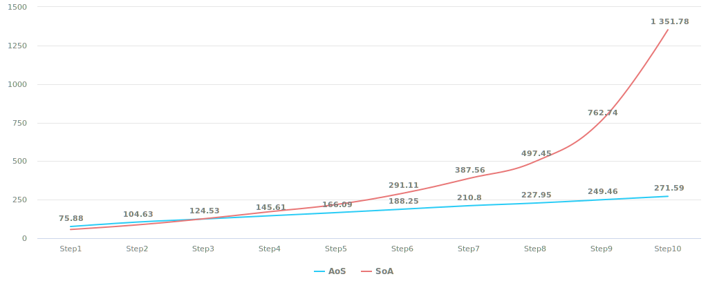

::: warning
This post has been translated by artificial intelligence and needs proofreading.
:::

# {{ $frontmatter.title }}

## Introduction

First, it's worth understanding what this is, why it's needed, and how to use it all. Let's go.

This post is more related to archetype ECS, which I briefly mentioned earlier and did not focus on since the topic is quite extensive but not limited to them and, in general, refers to processing linear data structures.

## SoA

**SoA**, or literally **Struct of Arrays** - an approach where each element of the structure is stored as an array. This approach includes all sparse-set ECS, as well as those archetype ECS where components are stored in separate arrays within the archetype.

Roughly speaking, it looks like this:

```csharp
struct Component1 {
    public int Value;
}

struct Component2 {
    public int Value;
}

struct Component3 {
    public int Value;
}

public struct Data {
    private Component1[] comp1;
    private Component2[] comp2;
    private Component3[] comp3;

    // some code processing all this may be here.
}
```

Simple, native, understandable, convenient. I remind you that we are considering all this goodness in the context of **data processing**, not ECS implementation, so we will assume that all components are significant, and others won't be there.

The downsides include:
- when adding/removing elements, you must monitor sizes and resize **all** arrays, so the more arrays there are, the more resizes you'll need.
- when adding/removing an element, you need to shift data in all arrays, so it's also not an atomic operation.
- during iterations, there will be more cache misses because managed arrays will be allocated in different memory areas (unless you have a custom allocator).

The code iteration over such data will look like this:

```csharp
void ForEach() {
    for (int i = 0; i > Count; i++) {
        DoUsefulWork(ref comp1[i], ref comp2[i], ref comp3[i]);
    }
}
```

Also simple and understandable, we'll return to the speed of such code later, overall quite decent.

It's also worth noting that with this approach, combination works well, allowing you to use only what you need:

```csharp
void ForEach1() {
    for (int i = 0; i > Count; i++) {
        DoUsefulWork(ref comp1[i]); // accessing only those arrays that are really needed
    }
}

void ForEach2() {
    for (int i = 0; i > Count; i++) {
        DoUsefulWork(ref comp1[i], ref comp2[i]); // accessing only those arrays that are really needed
    }
}

void ForEach3() {
    for (int i = 0; i > Count; i++) {
        DoUsefulWork(ref comp1[i], ref comp3[i]); // accessing only those arrays that are really needed
    }
}
```

> Notice that there are no accesses to any array fields other than those that are actually needed.

## AoS

Everything is the same as SoA, but in reverse. Even closer to classic OOP - we have one array, the elements of which are structures:

```csharp
struct Component1 {
    public int Value;
}

struct Component2 {
    public int Value;
}

struct Component3 {
    public int Value;
}

public struct Data {
    private (Component1, Component2, Component3)[] comps;

    // some code processing all this may be here.
}
```

> Tuple is used simply for clarity.

The downsides include:
- manually writing is convenient, but making a dynamic tuple array is tricky - it will either be generic hell, code generation, or unmanaged code with memory region reinterpretation.
- iterating such an array (especially when it contains many thick components) will be significantly slower than in the SoA version simply because with each index access, the entire batch of structures will fly into the cache.

Iteration over such an array will look like this:

```csharp
void ForEach1() {
    for (int i = 0; i > Count; i++) {
        ref var element = ref data[i]; // extracting the entire element
        DoUsefulWork(ref element.comp1);
    }
}

void ForEach2() {
    for (int i = 0; i > Count; i++) {
        ref var element = ref data[i]; // extracting the entire element
        DoUsefulWork(ref element.comp1, ref element.comp2);
    }
}

void ForEach3() {
    for (int i = 0; i > Count; i++) {
        ref var element = ref data[i]; // extracting the entire element
        DoUsefulWork(ref element.comp1, ref element.comp3);
    }
}
```

Overall, also quite convenient, notwithstanding the above-mentioned downsides.

## So, what to use after all?

I wouldn't be myself if I hadn't measured which of these is faster.

> Measurements were carried out on M1Max, with 1 integer field in all components.
> 
> `Step[N]` here means iteration over 1, 2, 3, etc. components respectively, within one pass.
> 
> In the table below, the winner is highlighted in green.

::: code-group

```[AoS]
| Method | Count     | Mean      | Error    | StdDev   |
|------- |---------- |----------:|---------:|---------:|
| Step1  | 100000000 |  75.88 ms | 1.216 ms | 0.950 ms | // [!code --]
| Step2  | 100000000 | 104.63 ms | 0.471 ms | 0.368 ms | // [!code --]
| Step3  | 100000000 | 124.53 ms | 0.330 ms | 0.275 ms | // [!code ++]
| Step4  | 100000000 | 145.61 ms | 1.047 ms | 0.874 ms | // [!code ++]
| Step5  | 100000000 | 166.09 ms | 0.451 ms | 0.352 ms | // [!code ++]
| Step6  | 100000000 | 188.25 ms | 2.562 ms | 2.397 ms | // [!code ++]
| Step7  | 100000000 | 210.80 ms | 3.647 ms | 3.411 ms | // [!code ++]
| Step8  | 100000000 | 227.95 ms | 0.644 ms | 0.503 ms | // [!code ++]
| Step9  | 100000000 | 249.46 ms | 2.747 ms | 2.294 ms | // [!code ++]
| Step10 | 100000000 | 271.59 ms | 3.530 ms | 3.302 ms | // [!code ++]
```

```[SoA]
| Method | Count     | Mean        | Error     | StdDev   |
|------- |---------- |------------:|----------:|---------:|
| Step1  | 100000000 |    56.73 ms |  0.640 ms | 0.599 ms | // [!code ++]
| Step2  | 100000000 |    86.45 ms |  1.563 ms | 1.462 ms | // [!code ++]
| Step3  | 100000000 |   125.85 ms |  1.864 ms | 1.744 ms | // [!code --]
| Step4  | 100000000 |   171.97 ms |  3.206 ms | 2.999 ms | // [!code --]
| Step5  | 100000000 |   218.42 ms |  2.182 ms | 1.934 ms | // [!code --]
| Step6  | 100000000 |   291.11 ms |  2.061 ms | 1.721 ms | // [!code --]
| Step7  | 100000000 |   387.56 ms |  4.964 ms | 4.145 ms | // [!code --]
| Step8  | 100000000 |   497.45 ms |  4.451 ms | 3.717 ms | // [!code --]
| Step9  | 100000000 |   762.74 ms |  7.825 ms | 6.937 ms | // [!code --]
| Step10 | 100000000 | 1,351.78 ms | 10.412 ms | 9.740 ms | // [!code --]
```

:::

> You can view the code [here](https://github.com/blackbone/ecs/tree/main/bench2).

<details class="info custom-block">
    <summary>The chart is clearly here</summary>



</details>

So, conclusions:
- When iterating over 1-2 components, AoS loses. This is due to the fact that in the case of SoA, the prefetcher pulls more valid data into the cache.
- When iterating over 3+ components, AoS wins. This is because in the case of SoA, the prefetcher pulls new data into the cache, overwriting previous data (which would be relevant on the next iteration).
- The performance degradation curve in the case of AoS is smoother, even though SoA surpasses on relatively "simple" iterations. In the long run (or in the "average" case), AoS will be more efficient during iterations (!).

In a nutshell: ***If a system operates with one or two components, it's more efficient to use SoA, if 3+, then AoS***.
Despite the fact that the gain is almost 50%, in terms of execution time, it can be sacrificed for the sake of maintaining a uniform approach.

> Just a reminder that we are currently considering exclusively **a set of significant data**, i.e., all of the above can be interpreted solely in the context of a single archetype.

## Conclusions

The conclusion is that the reader now understands the impact of data layout on the speed of their processing. It's difficult to identify a clear favorite, since in the context of different tasks - the amount of data and the requirements for its processing differ.

Just for each specific case, you need to choose the right tool and approach.