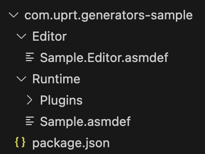
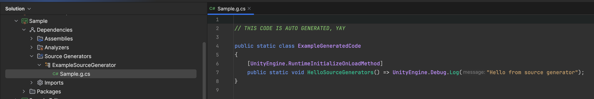

# {{ $frontmatter.title }}

Генераторы в шарпе тема прикольная, но не все умеют их варить и употреблять.
Меньше слов - больше слов.

## База:

Делать будем пакет состоящий из 3х частей:

*  Runitme - рантайм код проекта, к этой сборке и всем ее зависимостям будет применяться наш генератор
*  Editor - по необходимости, но обычно надо
*  Сам генератор - тут есть два варианта: полный пак и дллка, в данном посте будет второй.

И делать будем пакетом по 2м причинам: во первых - это позволит изолировать зависимости, во вторых - реюзать сам пакет между проектами.

Готовим все папочки и файлики в папке Packages проекта:



По содержимому объяснять не буду - стандартный пакет.

## Генератор:

Постараемся держать все минималистичным, поэтому будем делать генератор из дллки, но никто не мешает делать из райдеровского темплейта с тестами и настроенным дебаггером.

Добавляем сам проект генератора, для этого открываем терминал в папке пакета и пишем:

`dotnet new classlib -n SampleGenerator -o ./src~ -f netstandard2.0`

> **SampleGenerator** это название вашего генератора, лучше именовать как [package-name]Generator.

Это сгенерит проект с дллкой без солюшена. В нашем случае так и надо.

Если хотите фулл пак - создайте солюшен из темплейта в райдере или студии внутри папки ./src~.

>  Тильда в конце названия папки сделает ее невидимой для юньки, так что там можно будет шатать как хочешь.

Теперь нужно модифицировать проект генератора для совместимости с юнити.

Открываем файл проекта в vs code:

`code ./src~/`

И меняем содержимое:

```xml
<Project Sdk="Microsoft.NET.Sdk">
    
  <!-- настройки самого проекта, можете шатать как хотите в принципе -->
  <PropertyGroup>
      <!-- юнити требует именно эту версию -->
      <TargetFramework>netstandard2.0</TargetFramework>
      <Nullable>disable</Nullable>
      <IsPackable>false</IsPackable>
      <LangVersion>latest</LangVersion>
      <!-- чтобы при билде не геренировалась папка 'netstandard2.0' -->
      <AppendTargetFrameworkToOutputPath>false</AppendTargetFrameworkToOutputPath>
      <EnforceExtendedAnalyzerRules>true</EnforceExtendedAnalyzerRules>
      <IsRoslynComponent>true</IsRoslynComponent>
  </PropertyGroup>

  <!-- после билда в релизе копируем выхлоп в папку, которую видит юнити -->
  <Target Name="PostBuild" AfterTargets="PostBuildEvent" Condition=" '$(Configuration)' == 'Release' ">
      <Exec Command="cp bin/$(Configuration)/$(ProjectName).dll ../Runtime/Plugins/"/>
  </Target>

  <!-- cобственно сами пакеты которые сделают из dll'ки анализатор -->
  <ItemGroup>
      <PackageReference Include="Microsoft.CodeAnalysis" Version="4.0.1" PrivateAssets="all"/>
      <PackageReference Include="Microsoft.CodeAnalysis.CSharp" Version="4.0.1" PrivateAssets="all"/>
  </ItemGroup>
    
</Project>
```

>  Для юнити версии младше 2022 - версия пакетов должна быть 3.8.0.

Открываем Class1.cs в проекте и вставляем туда следующий код:

```csharp
using Microsoft.CodeAnalysis;

[Generator]
public class ExampleSourceGenerator : ISourceGenerator
{
    public void Initialize(GeneratorInitializationContext context) { }

    public void Execute(GeneratorExecutionContext context)
    {
        const string source = @"
// THIS CODE IS AUTO GENERATED, YAY

public static class ExampleGeneratedCode
{
    [UnityEngine.RuntimeInitializeOnLoadMethod]
    public static void HelloSourceGenerators() => UnityEngine.Debug.Log(""Hello from source generator"");
}
";

        context.AddSource("Sample.g.cs", source);
    }
}
```

## Интеграция:

Теперь надо сделать так чтоб генератор корректно подхватывался юнькой, для этого его нужно сначала собрать (:

`dotnet publish -c Release ./src~`

И переключаемся на юньку чтоб она сожрала свежесобранную дллку.
Нам нужен сгенерированный метафайл т.к. мы будем поставлять его вместе с проектом.

Открываем настройки импортера дллки, вырубаем все платформы в т.ч. редактор, вешаем лейбл RoslynAnalyzer - тут все по [юнити гайду](https://docs.unity3d.com/Manual/roslyn-analyzers.html).

## Результат:

Генератор мы настроили и работать он будет на сборке (asmdef), которая лежит у нас в папочке runtime и всех сборках на нее ссылающихся.

Чтоб триггернуть генерацию:

1. Создаем любой пустой скрипт в папке Runtime.
2. Открываем проект в райдере или студии.
3. Переключаемся на Solution View.
4. Смотрим что там у нас внутри сборки.



Voila! Наш сгенерированный код. А если клацнуть плеймод - то можно увидеть написанный дебаг лог.


