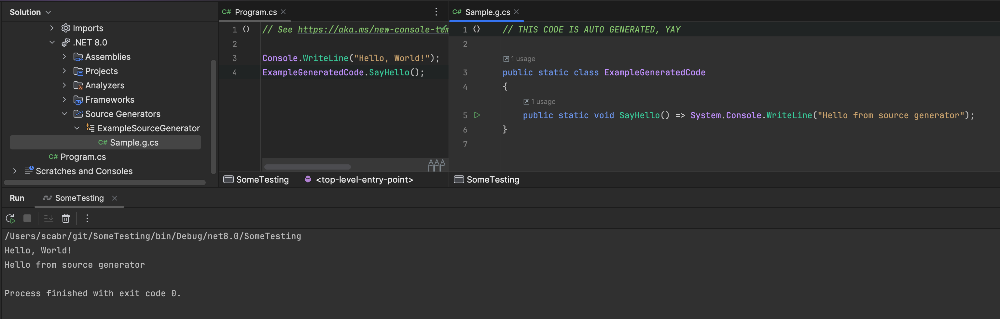

# {{ $frontmatter.title }}

## Preamble:

Source generators are a .NET feature, and you might want to use them for shared code (e.g., client-server). At some point, you'll need to determine if the code is being generated in the context of Unity. Let's dive in.

## How It Works:

A source generator is essentially a micro-program that runs during compilation for each assembly it is installed in and assemblies referencing it.

So, the top-level context is the compiling assembly - either a csproj in the context of .NET, or asmdef \ Assembly-CSharp in the context of Unity.

From the SG's perspective, these are the same .NET assemblies. But we need to somehow determine if it's Unity, so we'll hack and abuse Unity's build system, specifically its peculiarities.

Possible approaches:

* Compile the analyzer separately for Unity (or even have a separate one)
    * Pros: isolated and atomic.
    * Cons: requires an additional level of shared code between generators.
* Universal generator
    * Pros: universal.
    * Cons: need to consider two execution contexts in maintenance.

If the first approach is clear, the second is not so straightforward - we need to understand if "we're in Unity", so here's how.

## Determining if "We're In":

No suspense - we'll extract defines.

Unity injects defines like `UNITY_EDITOR`, `UNITY_5_3_OR_NEWER`, etc., into every compiling assembly.

Add the following properties to our generator:

```csharp
private bool IsUnity { get; set; }
private bool IsUnityEditor { get; set; }
```

and in the Execute method, add the following code at the very beginning:

```csharp
IsUnity = context.ParseOptions.PreprocessorSymbolNames.Any(define => define.Contains("UNITY"));
IsUnityEditor = context.ParseOptions.PreprocessorSymbolNames.Contains("UNITY_EDITOR");
```

It looks hacky, but in practice, it works reliably.

> You can easily check defines not only for Unity but for any of your build settings, whether in Unity or pure .NET.

Now let's edit the generator and see how it works.

The Execute method will look like this:

```csharp
public void Execute(GeneratorExecutionContext context)
{
    IsUnity = context.ParseOptions.PreprocessorSymbolNames.Any(define => define.Contains("UNITY"));
    IsUnityEditor = context.ParseOptions.PreprocessorSymbolNames.Contains("UNITY_EDITOR");

    var sb = new StringBuilder();
    sb.AppendLine("// THIS CODE IS AUTO GENERATED, YAY");
    sb.AppendLine();
    sb.AppendLine("public static class ExampleGeneratedCode");
    sb.AppendLine("{");
    if (IsUnity)
    {
        sb.AppendLine("	[UnityEngine.RuntimeInitializeOnLoadMethod]");
        sb.AppendLine("	public static void HelloSourceGenerators() => UnityEngine.Debug.Log("Hello from source generator");");
    }
    else
    {
        sb.AppendLine("public static void SayHello() => System.Console.WriteLine("Hello from source generator");");
    }
    sb.AppendLine("}");
    context.AddSource("Sample.g.cs", sb.ToString());
}
```

Build and check in Unity - nothing should change from the last post.

## Testing in .NET

Create a console app and link our generator, then add a reference to our source generator in the csproj:

```xml
<ItemGroup>
  <ProjectReference Include="[path to project]\Packages\[package name]\src~\[generator name].csproj" OutputItemType="Analyzer" ReferenceOutputAssembly="false"/>
</ItemGroup>
```

And call our generated method:

```csharp
ExampleGeneratedCode.SayHello();
```

And it works:



Cheers, more to come.
