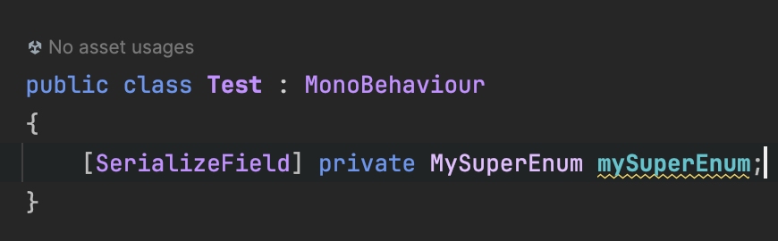

# {{ $frontmatter.title }}

::: warning
This post has been translated by artificial intelligence and needs proofreading.
:::

## Why?

Unity is a content-driven engine, and many things are done based on serialized content. This feature can be used in source generators, for example, to generate code from files configured in the editor.

The basis of the generator is from previous articles, and as an example, we will generate an enum. Let's go.

## Structure and Flow:

The task is to generate an enum from some serialized representation in the source generator both in Unity and pure .NET. This could be JSON, binary, or some custom format.

For clarity and context understanding, we will generate the enum according to the following rules:

1. The source is a text file with the extension .enum
2. Inside, values are listed similarly to .ini files - NAME=VALUE.
3. The namespace must match the root namespace of the assembly.

For these purposes, the Additional Files mechanism is perfect, which you can read about [here](https://github.com/dotnet/roslyn/blob/main/docs/analyzers/Using%20Additional%20Files.md).

We will name the file with our future enum MySuperEnum.enum and fill it with the following content:


By the way, you can start using .NET's SyntaxFactory to avoid struggling with string builders and formatting, so let's add this line to the usings - it will significantly ease the task:

`using static Microsoft.CodeAnalysis.CSharp.SyntaxFactory;`

And let's write another generator:

```csharp
using System.IO;
using System.Linq;
using Microsoft.CodeAnalysis;
using Microsoft.CodeAnalysis.CSharp.Syntax;
using static Microsoft.CodeAnalysis.CSharp.SyntaxFactory;
using SyntaxKind = Microsoft.CodeAnalysis.CSharp.SyntaxKind;

[Generator]
public class EnumSourceGenerator : ISourceGenerator
{
    public void Initialize(GeneratorInitializationContext context) { }

    public void Execute(GeneratorExecutionContext context)
    {
        // iterate over all additional files
        foreach (var additionalFile in context.AdditionalFiles)
        {
            // check the extension
            if (Path.GetExtension(additionalFile.Path) != ".enum") continue;
            
            // read content and prepare variables
            var values = File.ReadAllLines(additionalFile.Path)
                .Select(line => line.Split('='))
                .ToDictionary(line => line[0], line => line.Length > 1 ? int.Parse(line[1]) : (int?)null);
            var name = Path.GetFileNameWithoutExtension(additionalFile.Path);
            
            // generate enum code
            var enumValues = values.Select(kv =>
            {
                var (name, value) = (kv.Key, kv.Value);
                if (value.HasValue)
                    return EnumMemberDeclaration(name).WithEqualsValue(EqualsValueClause(
                        LiteralExpression(
                            SyntaxKind.NumericLiteralExpression,
                            Literal(value.Value))));

                return EnumMemberDeclaration(name);
            }).ToArray();

            // build namespace, enum type, and its values
            MemberDeclarationSyntax content = EnumDeclaration(name).AddMembers(enumValues);
            var namespaceName = context.Compilation.Assembly.NamespaceNames.FirstOrDefault(ns => !string.IsNullOrEmpty(ns));

            if (!string.IsNullOrEmpty(namespaceName)) // check namespace name
                content = NamespaceDeclaration(ParseName(namespaceName)).AddMembers(content);

            var root = CompilationUnit()
                .AddMembers(content)
                .WithLeadingTrivia(Comment("// THIS IS GENERATED ENUM. YAY"))
                .NormalizeWhitespace();
            
            context.AddSource($"{name}.g.cs", root.ToFullString());
        }
    }
}
```

The generator is done, let's move on.

## Integration in .NET:

Add our enum file to the .NET project and go to the settings. Open properties and select Build Action -> AdditionalFiles like this:


The generator should process this, and in the source generator output, we can see our enum:


> It is worth noting that, for example, Rider will regenerate the class every time we change the source file.

## Integration in Unity:

With Unity, it is a bit more complicated because we don't have project files per se; Unity generates them automatically, and editing them manually makes no sense because they will be overwritten at the next compilation.

But there is a way, and it's called csc.rsp. This is a special mechanism for passing external parameters to the MSBuild compiler.
We will use it to pass additional files.

To do this, create a csc.rsp file in the project folder with the following content:

`-additionalfile:"Assets/MySuperEnum.enum"`

Accordingly, the enum file should be in the root of the project.
Paths must be relative to the project root, which is inconvenient but can be solved with a custom asset importer.

Once everything is set up, we can see our enum in the Unity project:


Use it in our scripts:



And observe it in Unity itself:


What can you do with this in the future? Lots of things, as long as you have the imagination and patience.
Cheers, everyone!
