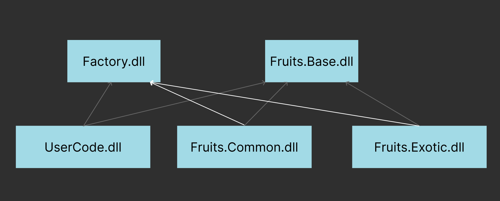
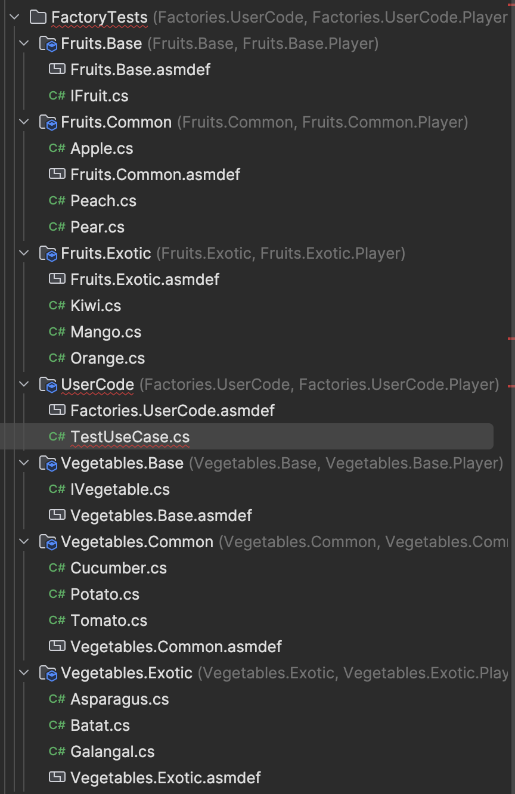
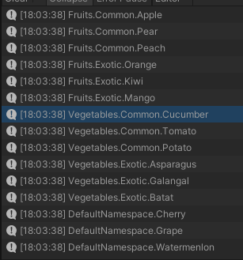

# {{ $frontmatter.title }}

## Problem:

Imagine we have an abstract class A and its descendants A1, A2, A3, etc., and we want to operate with the descendants as instances of the base, while instantiating based on some metadata unambiguously representing which specific type of instance we need, for example:

```csharp
IFruit apple = Factory<IFruit>.Create("apple");
```

or like this:

```csharp
IFruit orange = Factory<IFruit>.Create(Fruit.Orange);
```

or even like this:

```csharp
IFruit cherry = Factory.Create(Cherry.ID);
```

The main use case is creating components from some pre-prepared config in the process of forming entities (more details in a separate article).

## Constraints:

The main constraint is that the implementations of types used in the factory can be located in different assemblies, while it is necessary to correctly create them from anywhere the factory and base type are available.

If we imagine that our factory is located in the Factory.dll assembly, the base type IFruit is in the Fruits.Base.dll assembly, and all implementations are in other assemblies, such as Fruits.Common.dll, Fruits.Exotic.dll, etc. Meanwhile, the user code is in the UserCode.dll assembly as shown in the diagram below.

From the user code, we want to create instances of cherries and various oranges without explicitly referencing the assemblies in which they are declared, as we are not very interested in the implementation details (purely as an example).

The main question here is where exactly we will declare and register the factory methods (or delegates) that will directly create instances of the types we are interested in? The simple answer: where they are declared, such an approach will allow creating instances even of internal types without revealing the implementation details and without creating references between assemblies.

The pseudocode of the factory method will look like this:

```csharp
public static TValue Create<TValue, TKey>(in TKey key)
{
   switch(key) {
      // ... switch just to demonstrate the selection process
   } 
}
```

Based on the code above, the switch won't work, as it won't operate with generics, and as practice has shown, it is quite slow with a large number of elements.

The second constraint is the registration of types - somehow it is necessary to explicitly identify which factory the descendant type belongs to and by what key the instance of this type will be created. For this, we will use an attribute (it is possible to do without the attribute, but I prefer to explicitly see where and what is used in the code). The attribute should also be declared somewhere and it will be declared in the Factory.dll assembly, which will change the dependency graph as follows:



The child assemblies add a reference to the Factory.dll assembly, but this does not lead to cyclic dependencies or restrictions. Moreover, based on the features of how source generators work in Unity, it will allow tying source generators to all assemblies whose types are used in the factory - this is what we will abuse.

## Plan:

Create a package with the assembly that will contain our factory class and attribute.

Create a source generator and link it to this assembly.

The source generator will scan all types with our attribute and generate registration code, which will subsequently be used by the factory.

## Implementation:

Create a source generator as described in [this article](../1/index.md). Let's call all this Factories*.

Let's create some test types from which we will proceed:



And the test user code itself:

```csharp
namespace UserCode
{
    // No asset usages
    public class TestUseCase : MonoBehaviour
    {
        // Event function
        private void Start()
        {
            // fruits
            // common ones
            Debug.Log(message: Factory<IFruit, string>.Create(key: "apple"));
            Debug.Log(message: Factory<IFruit, string>.Create(key: "pear"));
            Debug.Log(message: Factory<IFruit, string>.Create(key: "peach"));

            // exotic ones
            Debug.Log(message: Factory<IFruit, string>.Create(key: "orange"));
            Debug.Log(message: Factory<IFruit, string>.Create(key: "kiwi"));
            Debug.Log(message: Factory<IFruit, string>.Create(key: "mango"));

            // vegetables
            // common ones
            Debug.Log(message: Factory<IVegetable, int>.Create(key: 101));
            Debug.Log(message: Factory<IVegetable, int>.Create(key: 102));
            Debug.Log(message: Factory<IVegetable, int>.Create(key: 103));

            // exotic ones
            Debug.Log(message: Factory<IVegetable, int>.Create(key: 201));
            Debug.Log(message: Factory<IVegetable, int>.Create(key: 202));
            Debug.Log(message: Factory<IVegetable, int>.Create(key: 203));

            // berries
            Debug.Log(message: Factory<IBerry, Berry>.Create(key: Berry.Cherry));
            Debug.Log(message: Factory<IBerry, Berry>.Create(key: Berry.Grape));
            Debug.Log(message: Factory<IBerry, Berry>.Create(key: Berry.Watermelon));
        }
    }
}
```

Explicit type specification doesn't look very pretty, later we can think about what to do with it, at this stage the main thing is that the API performs its function.

Now the attribute:

```csharp
namespace Factories
{
    [AttributeUsage(validOn: AttributeTargets.Class | AttributeTargets.Struct)]
    public sealed class FactoryAttribute : Attribute
    {
        public Type BaseType { get; }
        public object Key { get; }

        public FactoryAttribute(Type baseType, object key)
        {
            BaseType = baseType;
            Key = key;
        }
    }
}
```

We cannot use generics in attributes - therefore, we will use object. Moreover, it is necessary to explicitly specify the base type for unambiguous identification of the factory (this approach will also cover cases when an instance of one type can be created from different factories by different keys).

Using the example of an apple, the usage looks as follows:

```csharp
[Factory(typeof(IFruit), "apple")]
public class Apple : IFruit { }
```

Similarly, we place attributes on all test code.
For vegetables, an integer will be used instead of a string:

```csharp
[Factory(typeof(IVegetable), 101)]
public class Cucumber : IVegetable { }
```

The factory itself is implemented quite simply - through a dictionary with delegates (in which we will register factory methods):

```csharp
namespace Factories
{
    public static class Factory<TValue, TKey>
    {
        // exact delegate - instance producer
        public delegate TValue FactoryDelegate();

        private static readonly Dictionary<TKey, FactoryDelegate> CreationDelegates = new();

        /// <summary>
        /// Method used to register creation delegates for further use with <see cref="Create"/>.
        /// </summary>
        /// <param name="key">Unique key.</param>
        /// <param name="creationDelegate">Delegate which returns instance based on <see cref="key"/></param>
        /// <exception cref="InvalidOperationException">Thrown when key collision occurs.</exception>
        public static void Register(in TKey key, in FactoryDelegate creationDelegate)
        {
            if (!CreationDelegates.TryAdd(key, creationDelegate))
                throw new InvalidOperationException(message: $"Creation delegate with key "{key}" already added");
        }

        /// <summary>
        /// Creates new instance based on <see cref="key"/>
        /// </summary>
        /// <param name="key">Unique key identifying required type.</param>
        /// <returns>Instance of <see cref="TValue"/> derived type based on <see cref="key"/></returns>
        /// <exception cref="KeyNotFoundException">Thrown when key not registered.</exception>
        public static TValue Create(in TKey key)
        {
            if (!CreationDelegates.TryGetValue(key, out var creationDelegate))
                throw new KeyNotFoundException(message: $"Creation delegate with key "{key}" not found");
            return creationDelegate();
        }
    }
}
```

In the basic version, the factory is quite simple (and can be used manually). If necessary, we will expand it.

At this stage, everything is ready except for the actual registration of types, and it will even work if we manually register the types we are interested in, but that's not interesting - we need a source generator. Let's write it:

```csharp
[Generator]
public class FactoriesSourceGenerator : ISourceGenerator
{
    private bool IsUnity { get; set; }
    private bool IsUnityEditor { get; set; }

    public void Initialize(GeneratorInitializationContext context)
    {
        context.RegisterForSyntaxNotifications(() => new SyntaxReceiver());
    }

    public void Execute(GeneratorExecutionContext context)
    {
        if (context.SyntaxReceiver is not SyntaxReceiver syntaxReceiver) return;
        
        IsUnity = context.ParseOptions.PreprocessorSymbolNames.Any(define => define.Contains("UNITY"));
        IsUnityEditor = context.ParseOptions.PreprocessorSymbolNames.Contains("UNITY_EDITOR");
        
        // not working outside unity
        if (!IsUnity) return;
        
        // if attribute type not found - skip
        var attributeType = context.Compilation.GetTypeByMetadataName("Factories.FactoryAttribute");
        if (attributeType == null) return;
        
        // check all candidate classes
        foreach (var candidateType in syntaxReceiver.Candidates)
        {
            // getting type symbol
            var classSemanticModel = context.Compilation.GetSemanticModel(candidateType.SyntaxTree);
            var typeSymbol = classSemanticModel.GetDeclaredSymbol(candidateType) as INamedTypeSymbol;
            if (typeSymbol == null) continue;
            
            // getting type attributes
            var attributes = typeSymbol.GetAttributes();
            if (attributes.Length == 0) continue;
            
            // check contains required attribute
            var factoryAttribute = attributes.FirstOrDefault(a => a.AttributeClass != null && a.AttributeClass.Equals(attributeType, SymbolEqualityComparer.Default));
            if (factoryAttribute == null) continue;
            
            // validate constructor arguments
            if (factoryAttribute.ConstructorArguments.Length == 0) continue;
            if (factoryAttribute.ConstructorArguments[0].Value == null) continue;
            if (factoryAttribute.ConstructorArguments[1].Value == null) continue;
            
            // extract constructor arguments values
            var type = factoryAttribute.ConstructorArguments[0].Value as INamedTypeSymbol;
            var keyType = factoryAttribute.ConstructorArguments[1].Type;
            var key = factoryAttribute.ConstructorArguments[1].Value;
            
            // check arguments are valid
            if (type == null) continue;
            if (keyType == null) continue;
            if (key == null) continue;
            
            // generate registration code
            var sb = new StringBuilder();
            sb.AppendLine("// THIS CODE IS AUTO GENERATED, YAY");
            sb.AppendLine("using Factories;");
            sb.AppendLine();
            sb.AppendLine($"namespace {typeSymbol.ContainingNamespace}");
            sb.AppendLine("{");
            sb.AppendLine($"	internal static class {typeSymbol.Name}Registration");
            sb.AppendLine("	{");
            sb.AppendLine("		[UnityEngine.RuntimeInitializeOnLoadMethod]");
            sb.AppendLine($"		public static void Register() => Factory<{type}, {keyType}>.Register({Format(key, keyType)}, () => new {typeSymbol.Name}());");
            sb.AppendLine("	}");
            sb.AppendLine("}");
            context.AddSource($"{typeSymbol.ContainingNamespace}.{typeSymbol.Name}.g.cs", sb.ToString());
        }
    }

    private static string Format(object key, ITypeSymbol type)
    {
        // special formatting rules for strings and enums
        if (type.SpecialType == SpecialType.System_String) return $""{key}"";
        if (type.TypeKind == TypeKind.Enum) return $"({type}){key}";
        return key.ToString();
    }

    private class SyntaxReceiver : ISyntaxReceiver
    {
        public readonly List<TypeDeclarationSyntax> Candidates = new();
        
        public void OnVisitSyntaxNode(SyntaxNode syntaxNode)
        {
            // collecting candidate types
            if (syntaxNode is not TypeDeclarationSyntax typeDeclarationSyntax) return;
            var attributes = typeDeclarationSyntax.AttributeLists.SelectMany(al => al.Attributes).ToImmutableArray();
            if (attributes.Length == 0) return;
            if (attributes.All(a => !a.Name.ToString().Contains("Factory"))) return;
            Candidates.Add(typeDeclarationSyntax);
        }
    }
}
```

And the result of its work:



As we can see, the factory created instances for us using only keys in the user code, while we did not reference child assemblies and did not write boilerplate registration code.

## Notes:

1. We could remove the second generic argument and reduce the factory call signature to `Factory<IFruit>.Create("key")`, but this would lead to storing keys as objects and, consequently, even with a generic method signature inside, they would be boxed when accessing the dictionary. Moreover, further isolating factories by key type reduces the dictionary size, which positively affects access speed.
2. We could create static pre-typed classes, something like `IFruitFactory`, but the question immediately arises - where will this class be located? In theory, it can be placed in the assembly with the base type and work through it, registration can be done the same way, but there is one simple counterargument - this will spread the logic of using factories, and I, for example, will not be able to simply take and look at all the factories in the project, but it has its place.

## End:

The package is available on [GitHub](https://github.com/blackbone/factories). There is also a description of how to install and use it.
