# {{ $frontmatter.title }}

> Пост для обобщения информации и, возможно, помощи новичкам в понимании основных концепций.

Сразу отвечу:

> Да, я тоже собрался свой ECS писать и даже было пару попыток начать, но в тех или иных случаях упирался в какие-то ограничения, так что в этот раз буду двигаться основательно, поэтапно и возможно даже с фидбэком.

## Что есть ECS и как его едят

Что нам говорит [педивикия](https://en.wikipedia.org/wiki/Entity_component_system):

> Entity component system (ECS) is a software architectural pattern mostly used in video game development for the representation of game world objects. An ECS comprises entities composed from components of data, with systems which operate on the components.
> ECS follows the principle of composition over inheritance, meaning that every entity is defined not by a type hierarchy, but by the components that are associated with it. Systems act globally over all entities which have the required components.
> Due to an ambiguity in the English language, however, a common interpretation of the name is that an ECS is a system comprising entities and components.

Если в двух словах: *архитектурный паттерн, в котором сущности представляют из себя композицию компонентов, логика которых обрабатывается системами*.

Вся ECS каша собирается в одну кучу, и куча эта называется миром.

## World

World (или мир) - это верхнеуровневая абстракция, обычно класс, агрегирующий в себе множество сущностей и систем, которые изменяют и манипулируют сущностями в рамках контекста мира.

Мир, зачастую, так же имеет внешний апи позволяющий взаимодействовать с ним из внешнего контекста - например, создавать сущности при пользовательском или сетевом вводе.

Мир является, можно сказать, контейнером для сущностей, компонентов и систем.

## Entity

Сами по себе энтити без компонентов ничего из себя не представляют - их не могут обрабатывать системы, они не хранят пользовательские данные (могут, но это не канон) и не имеют собственного поведения.

В каноничных ECS - это просто индексы в глобальном массиве. В не-каноничных - некие абстрактные никакухи, что-то типа твоей одноклассницы, которую ты не можешь вспомнить. Во всех случаях - это уникальные идентификаторы однозначно определяющие сущность в конкретном мире.

Если в контексте мира идентификатор ничего из себя не представляет, то для внешнего контекста сам факт наличия сущности уже может иметь какое-то значение (но об этом тоже позже).
Component

Компоненты - кирпичики из которых строится энтити. Именно набор компонентов определяет что из себя представляет сущность. При этом эти кирпичики содержат только данные описывающие состояние сущности, но не содержат логики.

> Если летает и крякает - то это утка.
> Если есть летательный и крякательный компонент - то это тоже утка.
> Два одинаковых кряканься у утки быть не может, это либо одно и то же крякание, либо разные.

Но сами по себе компоненты жить не могут, так же как и не может существовать самостоятельное летание или крякание. Компонент - это свойство сущности, по этому и хранятся они вместе - компонент прямо или косвенно связан с айди сущности.

В самом тупом варианте данные можно представить как двухмерный массив или таблицу, где каждый столбец - это тип компонента, а каждая строка - индекс нашей энтити, примерно вот так:



Но с ростом количества сущностей и учитывая что не все компоненты будут использоваться на всех сущностях выглядеть это будет скорее вот так:



... масштаб уменьшен, но на средне-сложном проекте это сотня-две типов компонентов и несколько тысяч сущностей.

> Очень похоже на таблицу в реляционной БД с тем лишь отличием, что в каждой ячейке - отдельная структура данных.
> Но лично мне это напоминает таблицу истинности. Если их сгруппировать по существующим компонентам и отвязать от грида - то и на подмножество во можестве натянуть можно.
> К таблицам истинности и теории множеств я еще не раз вернусь.

Как можно заметить данные довольно разреженные и хранить их в двухмерном массиве будет не очень эффективно, особенно если учесть что это, скорее всего будут структуры, а не классы (и структуры и классы могут иметь разный размер, но на это плевать - т.к. храниться они будут где-то рандомно в куче), да еще и разного размера, но об этом позже - сейчас разбираемся с концепциями.

Помимо самого хранения данных ими еще необходимо манипулировать - изменять, получать, фильтровать и т.д. В большинстве фреймворков используются такие понятия как Filter, Query и System. Рассмотрим каждый по порядку:

## Filter / Query

Фильры и выборки, это что-то вроде SQL запроса `select entity from * where Component1 != null & Component2 != null & Component3 == null`, т.е. некий механизм выборки множества сущностей из всех существующих.

Обычно реализуется как имутабельный класс \ структура который морфится методами расширения и имеет метод возвращающий **подмножество сущностей**.

Для описанного выше фильтра соответствием из предыдущей иллюстрации будут сущности 3 и 9.

> На самом деле вся эта ECS белеберда очень сильно переплетается с булевой алгеброй и теорией множеств - советую [почитать](https://plato.stanford.edu/ENTRIES/boolalg-math/) или [посмотреть](https://www.youtube.com/playlist?list=PLTd6ceoshprcTJdg5AI6i2D2gZR5r8_Aw).

Фильтрация производится в большинстве случаев на основе наличия или отсутствия компонента, в редких случаях - на основе данных компонента по двум причинам:

1. Наличие и отсутствие компонента отслеживается для других областей использования ECS, в том числе для архетипов (о них позже).
2. Для обработки данных самого компонента их необходимо получить, что при большом количестве сущностей может знатно просадить перфу. К тому же, исходя из п.1 - информация о наличии компонента может храниться отдельно от данных и в иной форме, например, в битмаске.

> Некоторые реализации ECS поддерживают итерацию in place по фильтру без необходимости сохранять подмножество сущностей и итерироваться по нему.

> В некоторых фреймворках это единственный доступных механизм что-то сделать с сущностями массово, кроме прямых ссылок на сами сущности.

## System

Система - из канонического ECS, это сама логика манипуляции данными описанная (в идеале) как статическая функция принимающая в качестве аргументов ссылки на определенные компоненты и не возвращающая никаких значений.

> Самое интересное, что нигде не описано чья зона ответственности query'ть сущности и пропихивать в системы. Такая себе дыра в дизайне, как по мне.
> А может и не дыра, просто настолько размазанный паттерн "вот данные храните вот так, обрабатывайте вот так, а как вы одно с другим будете женить - нас особо не колышит".

На практике - обычно система представляет из себя инстанс класса реализующего интерфейс ISystem с методом Update, который пробрасывается в мир и хранится в нём. Это решает ряд таких проблем как:

1. Порядок вызова систем - определяется порядком добавления систем в мир.
2. Параметризация и инъекция зависимостей - инпут или какие-то конфиги, например.
3. Инъекция внутренних зависимостей - системам надо где-то брать ссылки на данные компонентов, поэтому, обычно, это делают сами системы при добавлении в мир (получают всякие пулы и стэши для того, чтоб потом их кверить).
4. Возможность "отключать" системы - иногда бывает полезно.

Системы редко работают с одним типом компонентов, чаще - с определенным набором, при этом часть компонентов выступают в качестве входных данных, часть в качестве выходных - но эти наборы не взаимоисключающие.

> Например, для перемещения объекта в пространстве нужны минимум 2 компонента: Position и Velocity, где каждый из них может выступать как входными данными, так и выходными - получаем текущую позицию и вектор движения, к позиции добавляем вектор * время, из вектора вычитаем дампинг, например.

> В сложных случаях количество компонентов может достигать десятка и более - но такие системы лучше декомпозировать на более атомарные.

## Archetype

Понятие архетипа родилось из проблемы итерации (привет DOD).

Когда мы имеем множество сущностей с большим количеством различных комбинаций на них - эффективно "прокручивать" через мясорубку систем можно только если все нужные компоненты лежат рядом, а мы просто в цикле берем нужные.

Отсюда родился подход "складывать уток к уткам, а яблоки к яблокам".

Такой подход позволяет обрабатывать как отдельно уток и яблоки, так и вместе если они оба съедобные.

С технической точки зрения архетип - это подмножества компонентов по признаку композиции. В иллюстрации ниже наглядно изображено как выглядит структура мира использующая архетипы:



Сложнее, страшнее, но позволяет итерироваться только по сущностям с нужным набором компонентов игнорируя другие.

Но есть и цена, прямой доступ через сущность обростает лишними обращениями ко всяким кэшам, маппингам, спарс сетам и тд. что негативно сказывается на производительности атомарных операций.

> Например, если нашей системе нужны все сущности с компонентами 1 и 3, то итерация будет происходить только по архетипу 4.

> Если по компонентам 3 и 6 - по архетипам 1 и 4 соответственно.

> Если мы хотим получить\изменить копонент 1 сущности 7, то нам надо:
> 1. залезть в таблицу архетипов и найти какой архетип у данной сущности.
> 2. залезть в архетип и найти под каким индексом хранятся данные этой сущости.
> 3. получить\изменить сам компонент по индексу в архетипе.

## Aspect

Есть и такая штука. По своей сути это просто набор типов компонентов, кусок архетипа, короче, некий 'признак' сущности.

Самый простой пример будет выглядеть примерно вот так:
```csharp
struct PositionComponent {
  public float x, y, z;
}

struct RotationComponent {
  public float x, y, z;
}

struct ScaleComponent {
  public float x, y, z;
}

struct TransformAspect {
  public PositionComponent position;
  public RotationComponent rotation;
  public ScaleComponent scale;
}
```

При этом с точки зрения API - ведет он себя как компонент, так же можно делать выборки, крутить в системах, фильтровать.
Но 'под капотом' интерпетируется как 'набор компонентов'.

На этом пока что всё, писять и спать. На каждом из этапов буду останавливаться подробнее далее и детально всё рассматривать и мерять.