# {{ $frontmatter.title }}

На данный момент реализаций ECS фреймворков расплодилось достаточно, но их можно разделить на несколько основных категорий.

1. Усы классические - это такие, где все компоненты одного типа хранятся в отдельном изолированном хранилище, а Entity является индексом доступа к ячейке в этом хранилище (прямо как индекс или косвенно через какой нибудь sparse set).
2. Усы модные - это такие, где в основе хранения компонентов лежат архетипы, т.е. компоненты сгруппированы по (условному) типу сущности, который определяется набором принадлежащей ей компонентов.
3. Усы экстравагантные - это когда компоненты разбросаны по куче, используются оба подхода, аспекты или еще каким-то особенным нестандартным образом это всё готовится.

Но обо всех по порядку.

## Классический ECS

Тут всё максимально просто - в минимальной реализации ECS будет иметь примерно следующий вид:

<details>
    <summary>World.cs</summary>

> Пример использования можно найти [тут](https://github.com/blackbone/ecs/tree/main/ecs1)

```csharp
public class World : IWorld<int>
{
    private struct ComponentWithFlag<T>
    {
        public bool flag;
        public T component;
    }

    private readonly Queue<int> freeEntityIds = new();
    private readonly Dictionary<Type, Array> components = new();
    
    private bool[] isAlive;

    public World(int entityCount = 256) => Resize(entityCount);

    private void Resize(in int size)
    {
        var initialSize = isAlive?.Length ?? 0;
        if (initialSize >= size) return;

        Array.Resize(ref isAlive, size);
        foreach (var (key, componentStorage) in components)
        {
            var newArray = Array.CreateInstance(componentStorage.GetType().GetElementType()!, size);
            componentStorage.CopyTo(newArray, componentStorage.Length);
            components[key] = componentStorage;
        }
        
        for (var i = initialSize; i < size; i++)
            freeEntityIds.Enqueue(i);
    }

    // CRUD [C]reate :: world
    public int CreateEntity()
    {
        if (freeEntityIds.Count == 0) Resize(isAlive.Length + 32);
        var entity = freeEntityIds.Dequeue();
        isAlive[entity] = true;
        return entity;
    }

    // CRUD [D]elete :: world
    public void DeleteEntity(in int entity) => isAlive[entity] = false;

    // CRUD [C]reate :: entity
    public void AddComponent<T>(in int entityId, in T c)
    {
        ComponentWithFlag<T>[] storage;
        if (components.TryGetValue(typeof(T), out var array)) storage = (ComponentWithFlag<T>[])array;
        else components[typeof(T)] = storage = new ComponentWithFlag<T>[isAlive.Length];
        
        if (storage[entityId].flag) throw new Exception($"Entity {entityId} already has {typeof(T)}");
        storage[entityId] = new ComponentWithFlag<T> { flag = true, component = c };
    }

    // CRUD [R]ead/[U]pdate :: entity
    public ref T GetComponent<T>(in int entityId)
    {
        ComponentWithFlag<T>[] storage;
        if (components.TryGetValue(typeof(T), out var array)) storage = (ComponentWithFlag<T>[])array;
        else components[typeof(T)] = storage = new ComponentWithFlag<T>[isAlive.Length];
        
        if (!storage[entityId].flag) throw new Exception($"Entity {entityId} has no {typeof(T)}");
        return ref storage[entityId].component;
    }

    // CRUD [D]elete :: entity
    public void DeleteComponent<T>(in int entityId)
    {
        ComponentWithFlag<T>[] storage;
        if (components.TryGetValue(typeof(T), out var array)) storage = (ComponentWithFlag<T>[])array;
        else components[typeof(T)] = storage = new ComponentWithFlag<T>[isAlive.Length];

        if (!storage[entityId].flag) throw new Exception($"Entity {entityId} has no {typeof(T)}");
        storage[entityId].flag = false;
        freeEntityIds.Enqueue(entityId);
    }
}
```

</details>

::: info
Я специально не реализовывал системы, фильтры и прочее, просто потому что в данном посте обсуждается структура мира как такового.

Так же я не добавлял код уменьшения размера просто чтобы он не занимал лишнее место, для понимания контекста не важен.
:::

Ну а в виде схемы оно выглядит примерно вот так:



Тут сразу можно заметить ряд проблем:

### Неоднозначность идентификации сущности

Если в одном месте программы сохранить индекс созданной сущности, а в другой - удалить и создать новую - старый указатель на сущность останется валидным, что может привести к ошибкам в пользовательском коде.

Постоянно крутить индекс вверх мы не можем, потому что хранилища компонентов в определенный момент выжрут всю память.

### Плохая утилизация хранилищ компонентов

Массивы ресайзятся под количество сущностей - при большом количестве сущностей и компонентов и маленькой их утилизации память будет тратиться в пустую.

Например, в мире 1.000.000 сущностей и, 100 типов компонентов со средним размером 16 байт каждый (4 float) - количество выделенной памяти будет равняться на такой набор 1.000.000 * 100 * 16 = 1.600.000.000 байт или 1.6GB только для хранения компонентов.

Но как я [писал ранее](/ru/posts/ecs/1/#entity) - утилизация компонентов, зачастую, очень разреженная и в лучшем случае на 1 сущность будет использоваться в среднем 2-3-5, да даже 10 компонентов, что будет составлять всего 10% от используемой памяти (или 160мб) - что является довольно существенной разницей.

### Фрагментация хранилищ

При удалении компонентов будут неизбежно образовываться дырки, т.е. аллоцированные элементы массива, но не используемые.

Но эта проблема возникает только при использовании спарс сетов или еще какого-то способа виртуальной адресации (когда фактический id сущности транслируется в локальный индекс внутри хранилища).

### Лейаут не оптимальный для чтения

Обычно пользователь работает с несколькими компонентами одновременно - добавляет velocty к position или вычитает hp по значению из currenDamageComponent (предварительно записанный туда еще откуда-то) и так далее.

Сами компоненты - это элементы массивов которые лежат в разных участках кучи и для эффективной обработки их надо "протащить" к транзисторам ЦПУ - и это в 99% случаев будет [cache miss](https://en.wikipedia.org/wiki/CPU_cache#Cache_miss).

Это дорого и это одна из причин почему "много считать" - "лагает", даже, пожалуй, главная.

Но к этому мы вернеммся потом.

---

Тем не менее именно так выглядят классические усы "под капотом", ну или как минимум задумывалось именно так.

## Архетипный ECS

Уже сложнее, писать объясняющий код я, конечно же, не буду, но схемку сделаю.

Она будет похожа на то, что я рисовал в [прошлой статье](/ru/posts/ecs/1/#archetype):



Почему картинки 2? Потому что подходов к реализации основных тоже два: [SoA и AoS](https://en.wikipedia.org/wiki/AoS_and_SoA). Подробно останавливаться на них не будем, просто отмечу разницу:

`world-1` - SoA подход. Для каждого типа компонента в рамках архетипа отдельный массив или любое другое линейное хранилище.

> В памяти элементы в рамках кархетипа распологаются как `c1, c1, c1, c1, ...`, `c2, c2, c2, ...`, `c3, c3, c3, ...`

`world-2` - AoS подход. Каждый архетип содержит 1 массив, элементами которого являются композиты сущностей (с1, с2, с3).

> В памяти элементы в рамках кархетипа распологаются как `c1, c2, c3, c1, c2, c3, c1, c2, c3, ....`

Как можно заметить у нас тут дырки отсутсвуют в обоих случаях, а если посчитать аналогичный лейаут (кстати на картинках 1 и 2 изображены два идентичных мира в разных парадигмах ECS) - то окажется что память используется куда более эффективно.

> Например в обоих случаях используется 33 инстанса компонента (по 4 байта это будет 132 байта), в классических усах под это дело выделено целых 352 байта (пустой 7й компонент я не считал).

Казалось бы - идеальное решение, ан-нет - от проблем данный подход тоже не избавлен:

### Структурные изменения

Предположим, что мы хотим добавить или удалить компонент сущности - в классическом ECS это будет атомарная операция, мы просто залезем в нужный массив и удалим.

В архетипных ECS же придется вытащить сущность из архетипа, удалить ее оттуда же, модифицировать (добавить или удалить компонент), расчитать новый архетип и добавить в него уже модифицированную сущность.

Накладно, да? - Да! Структурные изменения в архетипных ECS - это очень дорого, особенно когда на сущностях большие наборы больших компонентов.
Именно по этому поводу во многих реализациях архетипных ECS встречается возможность 'выключить' компонент.

### Фрагментированная память

Когда в мире много архетипов и мало сущностей разных архетипов (условно все сущности разные) - то храниться они будут в разных участках памяти, что при обработке повлечет за собой те же [cache misses](https://en.wikipedia.org/wiki/CPU_cache#Cache_miss).

Просто представим, что у нас в мире есть 100 сущностей и все с разными наборами компонентов, но не совсем разными. У всех есть `Position`, `Rotation`, `Mesh`, `Material` и еще какие-то общие базовые. Так вот было бы неплохо всё что ходит обрабатывать в 1 месте да еще и быстро.
Но каждая из этих сущностей будет лежать в отдельном архетипе где-то в рандомном месте в куче так что [data locality](http://gameprogrammingpatterns.com/data-locality.html) утилизировать не получится, будем постоянно скакать по куче.

### Сложная структура

Если сравнивать с классической реализацией - появляется много дополнительных вводных, за которыми надо следить: какой у сущности архетип, каким он станет при структурных изменениях, под каким индексом в каком архетипе находятся данные сущности и так далее.

Все это накладывает вычислительные расходы, что в общем случае замедляет работу системы.

## Экстравагантные решения

Углубляться не буду, но есть и 'прочие' подходы позволяющие, например, *навесить скрипт на сущность* или *навесить один инстанс компонента на несколько сущностей*, использовать синглтоны.
> В общем случае таких решений надо опасаться если они не решают вашу конкретную задачу.