# {{ $frontmatter.title }}

## Суть проблемы

Как я уже писал [вот тут](/ru/posts/ecs/2/#классическии-ecs) - наивно использовать EntityId как индекс в хранилищах компонентов не очень эффективно, хоть это и самый быстрый способ доступа (не считая ресайзов, конечно же). Неиспользуемая занятая память на практике с ростом количества типов сущностей будет стремиться к 100%, и я не первый кто об этом задумался.

Самым очевидным решением было бы хранить компоненты в словаре: Dictionary<entityId(int), data(TComponent)>.
Просто - да, O(1) - да, эффективно - нет, компоненты будут раскиданы по куче и будет очень много "скаканий по куче" и cache miss'ов. Такое себе.

## Ожидаемый результат

Тут стоит, наверное, описать к какому решению стоит стремиться и что в итоге мы хотим получить.

И так, ожидаемый результат:
1. Доступ к элементам за О(1) как на чтение, так и на запись.
2. Линейное расположение элементов в памяти.
3. Минимальный оверхед на вставку \ удаление элементов.

Желаемый API:
> Не забываем про CRUD

```csharp
interface IStorage<T>
{
    int Count { get; }

    ReadOnlySpan<T> All();
    ReadOnlySpan<int> AllEntities();

    // [C]reate
    void Add(in int entityIid, in T value);

    // [R]ead
    bool Has(in int entityIid);

    // [R]ead/[U]pdate
    ref T Ref(in int entityIid);

    // [D]elete
    void Remove(in int entityIid);
}
```

<div class="info custom-block">

Так же добавлены `Count`, `All()` и `AllEntities()` т.к. это довольно частая практика - итерироваться по существующим данным. Просто будем помнить что их надо прокинуть наружу.

</div>

<div class="warning custom-block">

Во всех моих примерах в качестве Entity Internal Identifier или entityIid 
[используется](https://github.com/blackbone/ecs/blob/103a52467314b7c9b82c67dda18d4ed9b08e87df/ecs2/EntityId.cs#L10) `int` -
в других фреймворках это может быть другой тип данных, это не принципиально. 

Принципиально то, что тут не используется EntityId целиком и не реализуются проверки на принадлежность миру и то, жива сущность или нет -
эти проверки производятся на верхнем уровне, данный элемент системы является т.н.
[**hot spot**](https://en.wikipedia.org/wiki/Hot_spot_(computer_programming)) или **hot path** - очень высоконагруженный элемент системы где даже
самая безобидная проверка может очень ощутимо просадить производительность - *быстрее всего работает код, которого нет*.

</div>

В качестве отправной точки будем отталкиваться от базовой "дырявой" линейной реализации:

```csharp
class Storage<T> : IStorage<T>
{
    private bool[]? has;
    private T[]? data;

    public int Count { get; private set; }
    public ReadOnlySpan<T> All() => throw new NotImplementedException();
    public ReadOnlySpan<int> AllEntities() => throw new NotImplementedException();

    public Storage() => Resize(32);
    
    public void Add(in int entityIid, in T value)
    {
        if (entityIid >= has!.Length) Resize((entityIid / 32 + 1) * 32);

        data![entityIid] = value;
        has![entityIid] = true;
        Count++;
    }

    public bool Has(in int entityIid) => entityIid < has!.Length && has[entityIid];

    public ref T Ref(in int entityIid) => ref data![entityIid];

    public void Remove(in int entityIid)
    {
        if (entityIid >= has!.Length) return;

        has[entityIid] = false;
        Count--;
    }

    private void Resize(in int size)
    {
        if (has == null)
        {
            has = new bool[size];
            data = new T[size];
            return;
        }

        var initialSize = has!.Length;
        if (initialSize >= size) return;
        
        Array.Resize(ref has, size);
        Array.Resize(ref data, size);
    }
}
```

Как можно заметить возможности реализовать `All()` и `AllEntities()` с текущим API эффективным способом нет, либо через `IEnumerator` либо аллоцировать новый массив, оба варианта не приемлемы, так что останавливаться на них, пока что, не будем.

В текущей реализации `entityIid` и является индексом в массиве `data` что очень удобно, но не эффективно - дырки всё таки.

Чтобы избавиться от дырок нужно сместить элементы массива влево, примерно вот так:



Компактно - да, что-то сломалось - тоже да: теперь `entityIid` не указывает на правильный элемент в массиве `data`. Простым математическим языком:

Было:   c<sub>e</sub> = data[i<sub>e</sub>]

Стало:  c<sub>e</sub> = data[i<sub>с</sub>] где i<sub>с</sub> = *f*(i<sub>e</sub>) ну или просто c<sub>e</sub> = data[*f*(i<sub>e</sub>)]

> Что за *f*()? Откуда оно взялось?

*f*() - функция преобразования `entityIid` во внутренний индекс внутри массива `data`. Это то что проделали с элементами на анимации выше: взяли тот индекс,
который равнялся `entityIid` и поменяли его на какой-то другой, причем такой, чтобы элементы плотненько лежали в массиве.

На самом деле выразить это через функцию возможным не представляется просто потому, что эти изменения зависят от пользовательского кода и не являются детерминированными,
но можно выразить через маппинг храня пару `entityIid` -> `index`.

> Тут можно использовать Dictionary!

Можно, но не будем т.к. есть вариант получше.

## Sparse Set

Разжовано [тут](https://www.geeksforgeeks.org/sparse-set/) и [тут](https://skypjack.github.io/2019-09-25-ecs-baf-part-5/) так что сильно углубляться я не буду.

В двух словах - это такой хитрый маппинг добавлением, чтением, записиью и удалением в О(1) но с определенными ограничениями, а именно:
- Может хранить только значения в диапазоне [0 : n), где n - максимальное число элементов.
- Будет дырявым вместо нашего массива с данными (это, в принципе, приемлемо)

Как это выглядит схематически:


От дырок в хранилище компонентов мы избавились, компоненты лежат линейно, всё? - Нет, не всё.

Будем считать, что с тем как это всё складывается и взаимосвязано разобрались, посмотрим на код:

В общем случае код будет иметь следующий вид:
```csharp
class Storage<T> : IStorage<T>
{
    private int[]? sparse;
    private int[]? dense;
    private T[]? data;

    public int Count { get; private set; }
    public ReadOnlySpan<T> All() => new(data, 0, Count);

    public Storage() => Resize(32, 32);

    public bool Has(in int entityIid) => sparse![entityIid] != -1;

    public ref T Ref(in int entityIid) => ref data![sparse![entityIid]];

    private void Resize(in int sparseSize, in int dataSize)
    {
        if (sparse == null)
        {
            sparse = new int[sparseSize];
            dense = new int[sparseSize];
            Array.Fill(dense, -1);
            Array.Fill(sparse, -1);
            data = new T[dataSize];
            return;
        }
        
        var initialSparseSize = sparse!.Length;
        if (initialSparseSize < sparseSize)
        {
            Array.Resize(ref sparse, sparseSize);
            Array.Resize(ref dense, sparseSize);
            Array.Fill(sparse, -1, initialSparseSize, sparseSize - initialSparseSize);
            Array.Fill(dense, -1, initialSparseSize, sparseSize - initialSparseSize);
        }

        var initialDataSize = data!.Length;
        if (initialDataSize < dataSize)
            Array.Resize(ref data, dataSize);
    }

    public ReadOnlySpan<int> AllEntities() => throw new NotImplementedException(); // <-- пока что игнорируем т.к. 
    public void Add(in int entityIid, in T value) => throw new NotImplementedException(); // <-- разберемся ниже
    public void Remove(in int entityIid) => throw new NotImplementedException(); // <-- разберемся ниже
}
```

Данный код учитывает, что компоненты уже лежат и лежат плотненько. Сигнатура метода `AllEntities()` под вопросом т.к.
идентификаторы никогда не смогут лежать плотнячком в `sparse`. C добавлением и удалением будем разбираться.

> У меня закрались сомнения об экономичности и эффективности такого подхода и я вооружился калькулятором и гугл таблицами.

<details class="info custom-block">
    <summary><b>Есть одна теория, и сейчас ее проверим</b></summary>

При слабой утилизации компонентов, большом количестве сущностей и маленьком размере компонентов мы **не** экономим память,
еще и добавляем дополнительные операции усложняющие чтение \ запись.

Ну и это надо проверить, определяем следующие значения и диапазоны:
1. **N**: Общее число сущностей - пусть будет 1000.
2. **C**: Размер компонента в байтах (sizeof, считаем что align = 8 и минимальный размер компонента тоже 8, шаг - тоже 8).
3. **U**: Утилизаця [0:1] c шагом 0.1 (10%) - какой % от всех сущностей имеет данный компонент, т.е. имеет значение.

Для простого линейного хранилища количество потребляемой памяти расчитывается как *`(C + 1) * N`*. `U` не учитывается т.к. мы выделяем память потенциально
под все возможные сущности.

На самом деле, раз уж мы упарываемся в оптимизации, для линейной реализации можно уменьшить потребление памяти используя битмаску и формула будет иметь
вид *`C * N + ceil(N / 8)`* - т.е. 1 байт на каждые 8 сущностей.

Для хранилища со спарс сетом это будет *`sizeof(int) * 2 * N + C * N * U`*.

Табличку с расчетами и график можно посмотреть тут, в принципе как и выводы.
Вертикальная ось - размер компонента

Горизонтальная - утилизация

<style>
    .measures tr:nth-child(1) td:nth-child(3) { background: #f005; }
    .measures tr:nth-child(1) td:nth-child(4) { background: #f005; }
    .measures tr:nth-child(1) td:nth-child(5) { background: #f005; }
    .measures tr:nth-child(1) td:nth-child(6) { background: #f005; }
    .measures tr:nth-child(1) td:nth-child(7) { background: #f005; }
    .measures tr:nth-child(1) td:nth-child(8) { background: #f005; }
    .measures tr:nth-child(1) td:nth-child(9) { background: #f005; }
    .measures tr:nth-child(1) td:nth-child(10) { background: #f005; }
    .measures tr:nth-child(1) td:nth-child(11) { background: #f005; }
    .measures tr:nth-child(1) td:nth-child(12) { background: #f005; }

    .measures tr:nth-child(2) td:nth-child(3) { background: #0f05; }
    .measures tr:nth-child(2) td:nth-child(4) { background: #0f05; }
    .measures tr:nth-child(2) td:nth-child(5) { background: #0f05; }
    .measures tr:nth-child(2) td:nth-child(6) { background: #0f05; }
    .measures tr:nth-child(2) td:nth-child(7) { background: #0f05; }
    .measures tr:nth-child(2) td:nth-child(8) { background: #f005; }
    .measures tr:nth-child(2) td:nth-child(9) { background: #f005; }
    .measures tr:nth-child(2) td:nth-child(10) { background: #f005; }
    .measures tr:nth-child(2) td:nth-child(11) { background: #f005; }
    .measures tr:nth-child(2) td:nth-child(12) { background: #f005; }

    .measures tr:nth-child(3) td:nth-child(3) { background: #0f05; }
    .measures tr:nth-child(3) td:nth-child(4) { background: #0f05; }
    .measures tr:nth-child(3) td:nth-child(5) { background: #0f05; }
    .measures tr:nth-child(3) td:nth-child(6) { background: #0f05; }
    .measures tr:nth-child(3) td:nth-child(7) { background: #0f05; }
    .measures tr:nth-child(3) td:nth-child(8) { background: #0f05; }
    .measures tr:nth-child(3) td:nth-child(9) { background: #f005; }
    .measures tr:nth-child(3) td:nth-child(10) { background: #f005; }
    .measures tr:nth-child(3) td:nth-child(11) { background: #f005; }
    .measures tr:nth-child(3) td:nth-child(12) { background: #f005; }

    .measures tr:nth-child(4) td:nth-child(3) { background: #0f05; }
    .measures tr:nth-child(4) td:nth-child(4) { background: #0f05; }
    .measures tr:nth-child(4) td:nth-child(5) { background: #0f05; }
    .measures tr:nth-child(4) td:nth-child(6) { background: #0f05; }
    .measures tr:nth-child(4) td:nth-child(7) { background: #0f05; }
    .measures tr:nth-child(4) td:nth-child(8) { background: #0f05; }
    .measures tr:nth-child(4) td:nth-child(9) { background: #0f05; }
    .measures tr:nth-child(4) td:nth-child(10) { background: #f005; }
    .measures tr:nth-child(4) td:nth-child(11) { background: #f005; }
    .measures tr:nth-child(4) td:nth-child(12) { background: #f005; }

    .measures tr:nth-child(5) td:nth-child(3) { background: #0f05; }
    .measures tr:nth-child(5) td:nth-child(4) { background: #0f05; }
    .measures tr:nth-child(5) td:nth-child(5) { background: #0f05; }
    .measures tr:nth-child(5) td:nth-child(6) { background: #0f05; }
    .measures tr:nth-child(5) td:nth-child(7) { background: #0f05; }
    .measures tr:nth-child(5) td:nth-child(8) { background: #0f05; }
    .measures tr:nth-child(5) td:nth-child(9) { background: #0f05; }
    .measures tr:nth-child(5) td:nth-child(10) { background: #0f05; }
    .measures tr:nth-child(5) td:nth-child(11) { background: #f005; }
    .measures tr:nth-child(5) td:nth-child(12) { background: #f005; }

    .measures tr:nth-child(6) td:nth-child(3) { background: #0f05; }
    .measures tr:nth-child(6) td:nth-child(4) { background: #0f05; }
    .measures tr:nth-child(6) td:nth-child(5) { background: #0f05; }
    .measures tr:nth-child(6) td:nth-child(6) { background: #0f05; }
    .measures tr:nth-child(6) td:nth-child(7) { background: #0f05; }
    .measures tr:nth-child(6) td:nth-child(8) { background: #0f05; }
    .measures tr:nth-child(6) td:nth-child(9) { background: #0f05; }
    .measures tr:nth-child(6) td:nth-child(10) { background: #0f05; }
    .measures tr:nth-child(6) td:nth-child(11) { background: #f005; }
    .measures tr:nth-child(6) td:nth-child(12) { background: #f005; }

    .measures tr:nth-child(7) td:nth-child(3) { background: #0f05; }
    .measures tr:nth-child(7) td:nth-child(4) { background: #0f05; }
    .measures tr:nth-child(7) td:nth-child(5) { background: #0f05; }
    .measures tr:nth-child(7) td:nth-child(6) { background: #0f05; }
    .measures tr:nth-child(7) td:nth-child(7) { background: #0f05; }
    .measures tr:nth-child(7) td:nth-child(8) { background: #0f05; }
    .measures tr:nth-child(7) td:nth-child(9) { background: #0f05; }
    .measures tr:nth-child(7) td:nth-child(10) { background: #0f05; }
    .measures tr:nth-child(7) td:nth-child(11) { background: #f005; }
    .measures tr:nth-child(7) td:nth-child(12) { background: #f005; }

    .measures tr:nth-child(8) td:nth-child(3) { background: #0f05; }
    .measures tr:nth-child(8) td:nth-child(4) { background: #0f05; }
    .measures tr:nth-child(8) td:nth-child(5) { background: #0f05; }
    .measures tr:nth-child(8) td:nth-child(6) { background: #0f05; }
    .measures tr:nth-child(8) td:nth-child(7) { background: #0f05; }
    .measures tr:nth-child(8) td:nth-child(8) { background: #0f05; }
    .measures tr:nth-child(8) td:nth-child(9) { background: #0f05; }
    .measures tr:nth-child(8) td:nth-child(10) { background: #0f05; }
    .measures tr:nth-child(8) td:nth-child(11) { background: #f005; }
    .measures tr:nth-child(8) td:nth-child(12) { background: #f005; }

    .measures tr:nth-child(9) td:nth-child(3) { background: #0f05; }
    .measures tr:nth-child(9) td:nth-child(4) { background: #0f05; }
    .measures tr:nth-child(9) td:nth-child(5) { background: #0f05; }
    .measures tr:nth-child(9) td:nth-child(6) { background: #0f05; }
    .measures tr:nth-child(9) td:nth-child(7) { background: #0f05; }
    .measures tr:nth-child(9) td:nth-child(8) { background: #0f05; }
    .measures tr:nth-child(9) td:nth-child(9) { background: #0f05; }
    .measures tr:nth-child(9) td:nth-child(10) { background: #0f05; }
    .measures tr:nth-child(9) td:nth-child(11) { background: #f005; }
    .measures tr:nth-child(9) td:nth-child(12) { background: #f005; }

    .measures tr:nth-child(10) td:nth-child(3) { background: #0f05; }
    .measures tr:nth-child(10) td:nth-child(4) { background: #0f05; }
    .measures tr:nth-child(10) td:nth-child(5) { background: #0f05; }
    .measures tr:nth-child(10) td:nth-child(6) { background: #0f05; }
    .measures tr:nth-child(10) td:nth-child(7) { background: #0f05; }
    .measures tr:nth-child(10) td:nth-child(8) { background: #0f05; }
    .measures tr:nth-child(10) td:nth-child(9) { background: #0f05; }
    .measures tr:nth-child(10) td:nth-child(10) { background: #0f05; }
    .measures tr:nth-child(10) td:nth-child(11) { background: #0f05; }
    .measures tr:nth-child(10) td:nth-child(12) { background: #f005; }

    .measures tr:nth-child(11) td:nth-child(3) { background: #0f05; }
    .measures tr:nth-child(11) td:nth-child(4) { background: #0f05; }
    .measures tr:nth-child(11) td:nth-child(5) { background: #0f05; }
    .measures tr:nth-child(11) td:nth-child(6) { background: #0f05; }
    .measures tr:nth-child(11) td:nth-child(7) { background: #0f05; }
    .measures tr:nth-child(11) td:nth-child(8) { background: #0f05; }
    .measures tr:nth-child(11) td:nth-child(9) { background: #0f05; }
    .measures tr:nth-child(11) td:nth-child(10) { background: #0f05; }
    .measures tr:nth-child(11) td:nth-child(11) { background: #0f05; }
    .measures tr:nth-child(11) td:nth-child(12) { background: #f005; }

    .measures tr:nth-child(12) td:nth-child(3) { background: #0f05; }
    .measures tr:nth-child(12) td:nth-child(4) { background: #0f05; }
    .measures tr:nth-child(12) td:nth-child(5) { background: #0f05; }
    .measures tr:nth-child(12) td:nth-child(6) { background: #0f05; }
    .measures tr:nth-child(12) td:nth-child(7) { background: #0f05; }
    .measures tr:nth-child(12) td:nth-child(8) { background: #0f05; }
    .measures tr:nth-child(12) td:nth-child(9) { background: #0f05; }
    .measures tr:nth-child(12) td:nth-child(10) { background: #0f05; }
    .measures tr:nth-child(12) td:nth-child(11) { background: #0f05; }
    .measures tr:nth-child(12) td:nth-child(12) { background: #f005; }

    .measures tr:nth-child(13) td:nth-child(3) { background: #0f05; }
    .measures tr:nth-child(13) td:nth-child(4) { background: #0f05; }
    .measures tr:nth-child(13) td:nth-child(5) { background: #0f05; }
    .measures tr:nth-child(13) td:nth-child(6) { background: #0f05; }
    .measures tr:nth-child(13) td:nth-child(7) { background: #0f05; }
    .measures tr:nth-child(13) td:nth-child(8) { background: #0f05; }
    .measures tr:nth-child(13) td:nth-child(9) { background: #0f05; }
    .measures tr:nth-child(13) td:nth-child(10) { background: #0f05; }
    .measures tr:nth-child(13) td:nth-child(11) { background: #0f05; }
    .measures tr:nth-child(13) td:nth-child(12) { background: #f005; }

    .measures tr:nth-child(14) td:nth-child(3) { background: #0f05; }
    .measures tr:nth-child(14) td:nth-child(4) { background: #0f05; }
    .measures tr:nth-child(14) td:nth-child(5) { background: #0f05; }
    .measures tr:nth-child(14) td:nth-child(6) { background: #0f05; }
    .measures tr:nth-child(14) td:nth-child(7) { background: #0f05; }
    .measures tr:nth-child(14) td:nth-child(8) { background: #0f05; }
    .measures tr:nth-child(14) td:nth-child(9) { background: #0f05; }
    .measures tr:nth-child(14) td:nth-child(10) { background: #0f05; }
    .measures tr:nth-child(14) td:nth-child(11) { background: #0f05; }
    .measures tr:nth-child(14) td:nth-child(12) { background: #f005; }

    .measures tr:nth-child(15) td:nth-child(3) { background: #0f05; }
    .measures tr:nth-child(15) td:nth-child(4) { background: #0f05; }
    .measures tr:nth-child(15) td:nth-child(5) { background: #0f05; }
    .measures tr:nth-child(15) td:nth-child(6) { background: #0f05; }
    .measures tr:nth-child(15) td:nth-child(7) { background: #0f05; }
    .measures tr:nth-child(15) td:nth-child(8) { background: #0f05; }
    .measures tr:nth-child(15) td:nth-child(9) { background: #0f05; }
    .measures tr:nth-child(15) td:nth-child(10) { background: #0f05; }
    .measures tr:nth-child(15) td:nth-child(11) { background: #0f05; }
    .measures tr:nth-child(15) td:nth-child(12) { background: #f005; }

    .measures tr:nth-child(16) td:nth-child(3) { background: #0f05; }
    .measures tr:nth-child(16) td:nth-child(4) { background: #0f05; }
    .measures tr:nth-child(16) td:nth-child(5) { background: #0f05; }
    .measures tr:nth-child(16) td:nth-child(6) { background: #0f05; }
    .measures tr:nth-child(16) td:nth-child(7) { background: #0f05; }
    .measures tr:nth-child(16) td:nth-child(8) { background: #0f05; }
    .measures tr:nth-child(16) td:nth-child(9) { background: #0f05; }
    .measures tr:nth-child(16) td:nth-child(10) { background: #0f05; }
    .measures tr:nth-child(16) td:nth-child(11) { background: #0f05; }
    .measures tr:nth-child(16) td:nth-child(12) { background: #f005; }
</style>
<div class="measures">

| Size | **LINEAR** | 0.1 | 0.2 | 0.3 | 0.4| 0.5 | 0.6  | 0.7 | 0.8 | 0.9 | 1 |
|---|---|---|---|---|---|---|---|---|---|---|---|
| 8 | **8125** | 8800 | 9600 | 10400 | 11200 | 12000 | 12800 | 13600 | 14400 | 15200 | 16000 |
| 16 | **16125** | 9600 | 11200 | 12800 | 14400 | 16000 | 17600 | 19200 | 20800 | 22400 | 24000 |
| 24 | **14125** | 10400 | 12800 | 15200 | 17600 | 20000 | 22400 | 24800 | 27200 | 29600 | 32000 |
| 32 | **32125** | 11200 | 14400 | 17600 | 20800 | 24000 | 27200 | 30400 | 33600 | 36800 | 40000 |
| 40 | **40125** | 12000 | 16000 | 20000 | 24000 | 28000 | 32000 | 36000 | 40000 | 44000 | 48000 |
| 48 | **48125** | 12800 | 17600 | 22400 | 27200 | 32000 | 36800 | 41600 | 46400 | 51200 | 56000 |
| 56 | **56125** | 13600 | 19200 | 24800 | 30400 | 36000 | 41600 | 47200 | 52800 | 58400 | 64000 |
| 64 | **64125** | 14400 | 20800 | 27200 | 33600 | 40000 | 46400 | 52800 | 59200 | 65600 | 72000 |
| 72 | **72125** | 15200 | 22400 | 29600 | 36800 | 44000 | 51200 | 58400 | 65600 | 72800 | 80000 |
| 80 | **80125** | 16000 | 24000 | 32000 | 40000 | 48000 | 56000 | 64000 | 72000 | 80000 | 88000 |
| 88 | **88125** | 16800 | 25600 | 34400 | 43200 | 52000 | 60800 | 69600 | 78400 | 87200 | 96000 |
| 96 | **96125** | 17600 | 27200 | 36800 | 46400 | 56000 | 65600 | 75200 | 84800 | 94400 | 104000 |
| 104 | **104125** | 18400 | 28800 | 39200 | 49600 | 60000 | 70400 | 80800 | 91200 | 101600 | 112000 |
| 112 | **112125** | 19200 | 30400 | 41600 | 52800 | 64000 | 75200 | 86400 | 97600 | 108800 | 120000 |
| 120 | **120125** | 20000 | 32000 | 44000 | 56000 | 68000 | 80000 | 92000 | 104000 | 116000 | 128000 |
| 128 | **128125** | 20800 | 33600 | 46400 | 59200 | 72000 | 84800 | 97600 | 110400 | 123200 | 136000 |

</div>

Можно заметить, что использование спарс сетов с точки зрения потребления памяти не выгодно в двух случаях:
- Очень маленькие компоненты.
- Очень плотная утилизация.

<div class="warning custom-block">

C дроблением компонентов на спарс-сетных ECS злоупотреблять не стоит, просто потратите память в пустую ради мнимой оптимизации.

</div>

</details>

## Добавление / Удаление

Методы добавления и удаления тесно связаны друг с другом, так что как всегда немножко теории.

Есть несколько стратегий утилизации памяти в линейных хранилищах, таких как массивы и в каждой из них надо разобраться, выбрав что-то подходящее.
> Сразу оговорюсь, что идеальной стратегии нет - в каждой из них свои плюсы и минусы.

### Списочный подход

Тут в целом всё просто:

::: code-group

```csharp [Add]
public void Add(in int entityIid, in T value)
{
    // убедились, что влезаем
    Resize((entityIid / 32 + 1) * 32, data!.Length == Count + 1 ? data.Length + 32 : data.Length)

    sparse![entityIid] = Count; // проставили индексы
    dense![Count] = entityIid;
    data![Count] = value; // записали данные
    Count++; // инкрементровали счетчик
}
```

```csharp [Remove]
public void Remove(in int entityIid)
{
    var arrayIndex = sparse![entityIid];
    Array.Copy(data!, arrayIndex + 1, data!, arrayIndex, Count - arrayIndex - 1);

    for (var i = arrayIndex; i < Count - 1; i++)
    {
      sparse![dense![i + 1]] = i;
        dense![i] = dense![i + 1];
    }

    Count--;
    sparse![entityIid] = -1;
    dense![Count] = -1;
}
```

:::

Посмотрим теперь как это всё выглядит схематически:

<details class="info custom-block">
  <summary><b>Добавление</b></summary>
    


</details>

<details class="info custom-block">
  <summary><b>Удаление</b></summary>
    


</details>

Если с `Add()` все более менее ок, то в `Remove()` имеем цикл - в худшем случае удалив первый добавленный компонент придется поправить **все** индексы,
O(n) короче говоря - не соответствует нашим требованиям.

> Лечится?

Да, лечится, поехали дальше.

### Remove and Swap Back

Очень интересный механизм удаления элементов массива очаровывающий своей простотой.

Суть его заключается в том, что вместо того чтобы сдвигать все элементы справа влево удаленный элемент просто заменяется последним.
Это позволяет намного быстрее удалять элементы по индексу за счет того, что копируется только 1 элемент. Как результат имеем удаление за константное время (не путать с константной сложностью).

Вот так это выглядит в коде:
> Такие штуки очень удобно реализовывать как методы расширения.

```csharp [RemoveAndSwapBack]
    public static void RemoveAndSwapBack<T>(in T[] array, in int index, ref int count)
        => array[index] = array[--count];
```

Ну собственно и всё. Последний элемент можно затереть если элементы массива являются ссылочными типами или структурами содержащими ссылочные типы для того, чтобы сборщик мусора их подхватил.
Но это тема отдельной статьи.

Схематически это выглядит вот так:


Классно и красиво, но есть и негативные стороны:
1. Нарушается порядок хранения элементов - в общем случае это не представляет большой проблемы, например, когда итерация происходит по одному типу компонента.
Но как мы выше разбирались - обращение будет происходить по айди сущности смаппленому к индексу в массиве и это будет скорее случайный доступ по индексам
что приведет к большому количеству cache misses (и скажется на производительности, соответственно). [Вот](https://www.youtube.com/watch?v=247cXLkYt2M) хорошее видео по этой теме.


<div class="info custom-block">

**В некоторых ECS фреймворках есть оптимизации направленные на упорядочивание памяти таким образом, чтобы итерации происходили всегда слева направо.**
**Это существенно ускоряет время итерации, но требует дополнительного времени на упорядочивание.**

</div>


Но вернемся к реализациям и посмотрим как оно будет выглядеть в контехсте хранилища компонентов.

```csharp [Remove]
public void Remove(in int entityIid)
{
    var arrayIndex = sparse![entityIid];
    var lastEntityIid = dense![--Count]; // [!code ++]
    data![arrayIndex] = data![Count]; // [!code ++]
    dense![arrayIndex] = lastEntityIid; // [!code ++]
    sparse[lastEntityIid] = arrayIndex; // [!code ++]
    Array.Copy(data!, arrayIndex + 1, data!, arrayIndex, Count - arrayIndex - 1); // [!code --]

    for (var i = arrayIndex; i < Count - 1; i++) // [!code --]
    { // [!code --]
      sparse![dense![i + 1]] = i; // [!code --]
      dense![i] = dense![i + 1]; // [!code --]
    } // [!code --]

    Count--; // [!code --]
    dense![Count] = -1; // [!code --]
    sparse![entityIid] = -1;

}
```

В сравнении с тем что было: минус цикл и константное количество операций не зависящее от размера и индекса удаляемого элемента.

<details class="info custom-block">
    <summary><b>Но кто я такой чтобы не померять это всё</b></summary>

| Type              | Method  | Count  | Mean             | Error          | StdDev         | Median           |
|------------------ |-------- |------- |-----------------:|---------------:|---------------:|-----------------:|
| RemoveAndSwapBack | Reverse | 10000  |         41.68 us |       0.825 us |       1.209 us |         41.79 us |
| RemoveAndSwapBack | Linear  | 10000  |         42.82 us |       0.851 us |       1.399 us |         42.83 us |
| RemoveAndSwapBack | Random  | 10000  |         45.59 us |       0.903 us |       1.075 us |         45.50 us |
| List              | Reverse | 10000  |         61.86 us |       1.353 us |       3.725 us |         61.48 us |
| RemoveAndSwapBack | Reverse | 100000 |        290.98 us |       5.730 us |       8.217 us |        286.89 us |
| RemoveAndSwapBack | Linear  | 100000 |        295.25 us |       5.882 us |       7.002 us |        295.54 us |
| RemoveAndSwapBack | Random  | 100000 |        409.35 us |       7.702 us |       7.565 us |        405.67 us |
| List              | Reverse | 100000 |        440.00 us |       8.429 us |       7.472 us |        437.75 us |
| RemoveAndSwapBack | Reverse | 250000 |        687.89 us |       3.690 us |       3.081 us |        687.25 us |
| RemoveAndSwapBack | Linear  | 250000 |        691.51 us |       3.748 us |       3.322 us |        691.50 us |
| List              | Reverse | 250000 |      1,059.04 us |      16.636 us |      15.561 us |      1,057.12 us |
| RemoveAndSwapBack | Random  | 250000 |      1,064.65 us |      19.698 us |      36.512 us |      1,048.54 us |
| List              | Random  | 10000  |     28,061.13 us |     490.183 us |     434.534 us |     27,916.44 us |
| List              | Linear  | 10000  |     57,214.52 us |     686.687 us |     642.328 us |     57,218.58 us |
| List              | Random  | 100000 |  2,898,043.15 us |  57,450.454 us |  72,656.430 us |  2,859,386.54 us |
| List              | Linear  | 100000 |  5,824,036.29 us |  73,614.984 us |  61,471.846 us |  5,812,698.46 us |
| List              | Random  | 250000 | 17,908,060.10 us | 249,017.326 us | 232,930.961 us | 17,889,613.81 us |
| List              | Linear  | 250000 | 36,972,363.97 us | 472,965.859 us | 442,412.558 us | 36,850,371.92 us |

Ожидаемо, да, в разы быстрее ну и понятно, в принцпе почему. Но тут можно сделать еще ряд интересных наблюдений:

- `Random()` быстрее `Linear()` в случае `List`, а самым быстрым оказался `Reverse()`.
> Это связано с тем, что в при линейной итерации от начала к концу количество и объем копированной памяти будет максимальным,
т.е. мы всегда удаляем первый элемент и копируем весь "хвост". В случае с Random мы копируем в среднем половину всей длинны.
А в случае Reverse - удалении последнего элемента мы копируем элемент сам в себя, только 1 (этот кейс можно обработать отдельно и просто декрементить `Count`).

- `Random()` медленнее `Linear()` в случае `RemoveAndSwapBack`, а `Reverse()` быстрее.
> Поскольку у нас операция атомарная и нет необходимости манипулировать "хвостом", то всё сводится к скорости доступа к элементам массива.
При линейной итерации максимизируется утилизация prefetcher'а (почитать об этом можно вот [тут](https://en.wikipedia.org/wiki/Cache_prefetching).
При случайном доступе чаще происходят промахи в кэше, что, собственно, и прослеживается в бенчмарке.
> `Reverse()` быстрее потому что нет необходимости прыгать между текущим индексом и последним, таким образом избегаются промахи в кэше.

</details>

### Можно ли еще быстрее?

В теории - можно, но только за счет отложенных операций укомпакчивания хранилищ, которые при этом будут максимально сохранять порядок хранимых компонентов.

Как еще ускорить in-place версию я не знаю =)

## Выводы

Sparse Sets - не идеальное решение, по крайней мере не для всех случаев.

Укомпакчивать in-place лучше через RemoveAndSwapBack.

Код бенчмарков можно найти [тут](https://github.com/blackbone/ecs/tree/main/bench), а код хранилищ [тут](https://github.com/blackbone/ecs/tree/main/ecs3).