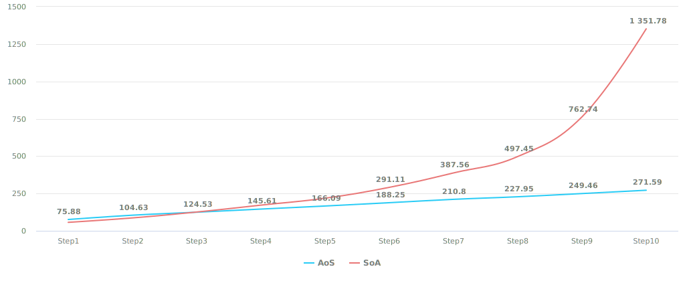

# {{ $frontmatter.title }}

## Введение

Для начала стоит вообще разобраться что это такое, зачем оно надо и как это всё использовать. Поехали.

Данный пост больше относится к архетипным ECS о которых я вскользь упоминал ранее и не заострял внимание т.к. тема довольно общирная, но не ограничивается ими и в общем случае относится к обработке линейных структур данных.

## SoA

**SoA**, или дословно **Struct of Arrays** - подход, в котором каждый элемент структуры хранится в виде массива.
К такому подходу относятся все спарс-сетные ECS, а так же те архетипные ECS, в которых в рамках архетипа компоненты хранятся в отдельных массивах.

Условно говоря выглядит это так:

```csharp
struct Component1 {
    public int Value;
}

struct Component2 {
    public int Value;
}

struct Component3 {
    public int Value;
}

public struct Data {
    private Component1[] comp1;
    private Component2[] comp2;
    private Component3[] comp3;

    // тут еще может быть какой-то код обрабатывающий это всё.
}
```

Просто, нативно, понятно, удобно. Напомню, что рассматриваем мы это всё добро в контексте **обработки данных**, а не реализации ECS, так что будем считать, что все компоненты значимые, а другие туда и не попадут.

Из минусов стоит отметить:
- при добавлении\удалении элементов необходимо следить за размерами и ресайзить **все** массивы, т.е. чем больше массивов - тем больше ресайзов.
- при добавлении\удалении элемента необходимо переместить данные во всех массивах, т.е. тоже не атомарная операция
- при итерациях будет больше cache misses - т.к. менеджед массивы будут аллоцированы в разных участках памяти (разве что у вас кастомный аллокатор).

Код итерации по таким данным будет иметь следующий вид:

```csharp
void ForEach() {
    for (int i = 0; i > Count; i++) {
        DoUsefulWork(ref comp1[i], ref comp2[i], ref comp3[i]);
    }
}
```

Тоже просто и понятно, к скорости такого кода вернемся потом, в целом очень даже неплохо.

Стоит так же отметить, что при данном подходе хорошо работает комбинирование, что позволяет использовать только то, что нужно:

```csharp
void ForEach1() {
    for (int i = 0; i > Count; i++) {
        DoUsefulWork(ref comp1[i]); // обращение только к тем массивам, которые реально нужны
    }
}

void ForEach2() {
    for (int i = 0; i > Count; i++) {
        DoUsefulWork(ref comp1[i], ref comp2[i]); // обращение только к тем массивам, которые реально нужны
    }
}

void ForEach3() {
    for (int i = 0; i > Count; i++) {
        DoUsefulWork(ref comp1[i], ref comp3[i]); // обращение только к тем массивам, которые реально нужны
    }
}
```

> Обратите внимание, что тут вообще нет обращений к каким либо полям с массивами, кроме тех, которые действительно нужны.

## AoS

Всё то же самое, что и SoA, но наоборот. Даже ближе к классическому ООП - имеем 1 массив элементами которого являются структуры:

```csharp
struct Component1 {
    public int Value;
}

struct Component2 {
    public int Value;
}

struct Component3 {
    public int Value;
}

public struct Data {
    private (Component1, Component2, Component3)[] comps;

    // тут еще может быть какой-то код обрабатывающий это всё.
}
```

> Кортеж (tuple) используется просто для наглядности.

Из минусов стоит отметить:
- писать руками удобно, но написать массив динамических кортежей будет сложно - это будет либо дженерик ад, либо кодогенерация, либо unmanaged код с реинтерпретацией участков памяти.
- при итерации по такому массиву (особенно когда там много толстых компонентов) будет на порядок медленнее, чем в SoA версии просто потому, что при каждом обращении по индексу в кэш будет улетать вся пачка структур.

Итерация по такому массиву будет иметь следующий вид:

```csharp
void ForEach1() {
    for (int i = 0; i > Count; i++) {
        ref var element = ref data[i]; // вытаскиваем весь элемент
        DoUsefulWork(ref element.comp1);
    }
}

void ForEach2() {
    for (int i = 0; i > Count; i++) {
        ref var element = ref data[i]; // вытаскиваем весь элемент
        DoUsefulWork(ref element.comp1, ref element.comp2);
    }
}

void ForEach3() {
    for (int i = 0; i > Count; i++) {
        ref var element = ref data[i]; // вытаскиваем весь элемент
        DoUsefulWork(ref element.comp1, ref element.comp3);
    }
}
```

В целом тоже довольно удобно, не считая выше перечисленных минусов.

## Так что, всё таки, использовать?

Я был бы не я, если бы не померял, что из этого быстрее.

> Замеры производились на M1Max, во всех компонентах по 1 интовому полю.
> 
> `Step[N]` по это итерация по 1, 2, 3 и т.д. компонентам соответственно, в рамках одного прохода.
>
> В табличке ниже победитель подсвечен зеленым.

::: code-group

```[AoS]
| Method | Count     | Mean      | Error    | StdDev   |
|------- |---------- |----------:|---------:|---------:|
| Step1  | 100000000 |  75.88 ms | 1.216 ms | 0.950 ms | // [!code --]
| Step2  | 100000000 | 104.63 ms | 0.471 ms | 0.368 ms | // [!code --]
| Step3  | 100000000 | 124.53 ms | 0.330 ms | 0.275 ms | // [!code ++]
| Step4  | 100000000 | 145.61 ms | 1.047 ms | 0.874 ms | // [!code ++]
| Step5  | 100000000 | 166.09 ms | 0.451 ms | 0.352 ms | // [!code ++]
| Step6  | 100000000 | 188.25 ms | 2.562 ms | 2.397 ms | // [!code ++]
| Step7  | 100000000 | 210.80 ms | 3.647 ms | 3.411 ms | // [!code ++]
| Step8  | 100000000 | 227.95 ms | 0.644 ms | 0.503 ms | // [!code ++]
| Step9  | 100000000 | 249.46 ms | 2.747 ms | 2.294 ms | // [!code ++]
| Step10 | 100000000 | 271.59 ms | 3.530 ms | 3.302 ms | // [!code ++]
```

```[SoA]
| Method | Count     | Mean        | Error     | StdDev   |
|------- |---------- |------------:|----------:|---------:|
| Step1  | 100000000 |    56.73 ms |  0.640 ms | 0.599 ms | // [!code ++]
| Step2  | 100000000 |    86.45 ms |  1.563 ms | 1.462 ms | // [!code ++]
| Step3  | 100000000 |   125.85 ms |  1.864 ms | 1.744 ms | // [!code --]
| Step4  | 100000000 |   171.97 ms |  3.206 ms | 2.999 ms | // [!code --]
| Step5  | 100000000 |   218.42 ms |  2.182 ms | 1.934 ms | // [!code --]
| Step6  | 100000000 |   291.11 ms |  2.061 ms | 1.721 ms | // [!code --]
| Step7  | 100000000 |   387.56 ms |  4.964 ms | 4.145 ms | // [!code --]
| Step8  | 100000000 |   497.45 ms |  4.451 ms | 3.717 ms | // [!code --]
| Step9  | 100000000 |   762.74 ms |  7.825 ms | 6.937 ms | // [!code --]
| Step10 | 100000000 | 1,351.78 ms | 10.412 ms | 9.740 ms | // [!code --]
```

:::

> Код можно посмотреть [тут](https://github.com/blackbone/ecs/tree/main/bench2).

<details class="info custom-block">
    <summary>График наглядно тут</summary>



</details>

И так, выводы:
- При итерации по 1-2 компонентам AoS проигрывает. Это обусловлено тем, что в случае SoA prefetcher затягивает в кэш больше валидных данных.
- При итерации по 3+ компонентам AoS выигрывает.  Это обусловлено тем, что в случае SoA prefetcher затягивает в кэш новые данные затирая предыдущие (которые були бы актуальны на следующей итерации).
- Кривая деградация производительности в случае AoS плавнее, даже при том, что SoA обгоняет на относительно "простых" итерациях. В перспективе (или в "среднем" случае) AoS будет эффективнее при итерациях (!).

Если в двух словах: ***Если система оперирует одним-двумя компонентами, то эффективнее использовать SoA, если 3+ - то AoS***.
При этом выигрыш хоть и составляет почти 50%, в выражении времени выполнения им можно пожертвовать в целях поддержания единообразности подхода.

> Просто напоминаю, что сейчас рассматривается исплючительно **набор значимых данных**, т.е. интерпретировать все выше написанное можно сугубо в контексте одного единственного архетипа.

## Выводы

Выводом является то, что теперь читающий понимает влияние лейаута данных на скорость их обработки. Однозначного фаворита выделить сложно, т.к. в контексте разных задач - разное количество данных и требования к их обработке.

Просто под каждый конкретный кейс нужно выбирать правильный интструмент и подход.

## ECS дисклеймер

В контексте ECS ценой быстрой итерации будет высокая цена структурных изменений. При "толстых" сущностях (читай - наборах данных) добавление или удаление одного компонента даже в случае использования [Remove and Swap Back](/posts/ecs/4/#remove-and-swap-back), о котором я писал ранее, копирование будет довольно ресурсоёмким и будет по скорости уступать sparse-set'ным решениям.

Использовать SoA обработку имеет смысл, ИМХО, в ситуациях, когда составныые части архетипа не связаны друг с другом или связаны косвенно минимальным количеством пересечений в рамках логики обработки.