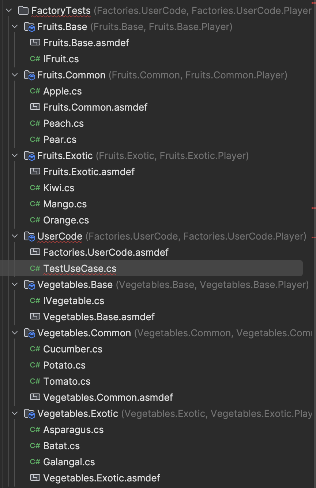
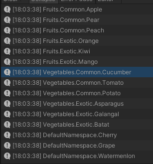

# {{ $frontmatter.title }}

## Проблема:

Представим что у нас есть абстрактный класс A и его наследники А1, А2, А3 и т.д. и мы хотим оперировать наследниками как инстансами базы, при этом инстанциировать на основе каких-то мета-данных однозначно представляющих какой именно тип инстанса нам нужен, например:

```csharp
IFruit apple = Factory<IFruit>.Create("apple");
```

или так:

```csharp
IFruit orange = Factory<IFruit>.Create(Fruit.Orange);
```

или даже так:

```csharp
IFruit cherry = Factory.Create(Cherry.ID);
```

Главный юз кейс - создание компонентов из какого-то предзаготовленного конфига в процессе формирования сущностей (детальнее в отдельной статье).

## Ограничения:

Главное ограничение - это то, что реализации типов используемых в фабрике могут распологаться в разных сборках, при этом необходимо корректно их создавать из любого места где доступна фабрика и базовый тип.

Если мы представим что наша фабрика находится в сборке Factory.dll, базовый тип IFruit находится в сборке Fruits.Base.dll, а все реализации находятся в других сборках, таких как Fruits.Common.dll, Fruits.Exotic.dll и тд. При этом пользовательский код находится в сборке UserCode.dll как на рисунке ниже.

Из пользовательского кода мы хотим создавать инстансы вишен и всяких апельсинов при этом явно не ссылаясь на сборки, в которых они объявлены, т.к. мы не очень заинтересованы в деталях реализации (чисто например).

Главным вопросом здесь является - где именно мы объявим и зарегистируем фабричные методы (или делегаты) которые непосредственно будут создавать инстансы интересующих нас типов? Ответ простой: там же где они объявлены, такой подход позволит создавать инстансы даже интернал типов не раскрывая детали реализации и не плодя ссылки между сборками.

Псевдокод фабричного метода будет иметь следующий вид:

```csharp
public static TValue Create<TValue, TKey>(in TKey key)
{
   switch(key) {
      // ... свич чисто для демонстрации того, что тут происходит селект
   } 
}
```

Исходя из кода выше - свич не прокатит, т.к. с дженериками он работать не будет, да и, как показала практика - на большом количестве элементов он довольно медленный.

Вторым ограничением является регистрация типов - каким-то образом надо явно идентифицировать к какой именно фабрике относится тип-наследник и по какому именно ключу инстанс данного типа будет создаваться. Для этого будем использовать аттрибут (можно обойтись и без аттрибута, но я предпочитаю явно видеть по коду где и что используется). Аттрибут тоже должен быть где-то объявлен и объявлен он будет в сборке Factory.dll, что изменит граф зависимостей следующим образом:


У дочерних сборок добавляется ссылка на сборку Factory.dll, но это не приводит ни к циклическим зависимостям ни к ограничениям. К тому же, исходя из особенностей работы source generators в unity - позволит подвязать сорс генераторы ко всем сборкам, типы которых используются в фабрике - это и будем абъюзить.

## План:

Создаем пакет со сборкой в которой будет наш фабричный класс и аттрибут.

Создаем сорс генератор и линкуем его к этой сборке.

Сорс генератор шерстит все типы с нашим аттрибутом и генерирует регистрирующий код, который в последствии используется фабрикой.

## Реализация:

Создаем сорс генератор как описано в [этой статье](../1/index.md). Обзовем это всё Factories*.

Создадим немножко тестовых типов от которых будем плясать:



Ну и сам тестовый юзер код:

```csharp
namespace UserCode
{
    // No asset usages
    public class TestUseCase : MonoBehaviour
    {
        // Event function
        private void Start()
        {
            // fruits
            // common ones
            Debug.Log(message: Factory<IFruit, string>.Create(key: "apple"));
            Debug.Log(message: Factory<IFruit, string>.Create(key: "pear"));
            Debug.Log(message: Factory<IFruit, string>.Create(key: "peach"));

            // exotic ones
            Debug.Log(message: Factory<IFruit, string>.Create(key: "orange"));
            Debug.Log(message: Factory<IFruit, string>.Create(key: "kiwi"));
            Debug.Log(message: Factory<IFruit, string>.Create(key: "mango"));

            // vegetables
            // common ones
            Debug.Log(message: Factory<IVegetable, int>.Create(key: 101));
            Debug.Log(message: Factory<IVegetable, int>.Create(key: 102));
            Debug.Log(message: Factory<IVegetable, int>.Create(key: 103));

            // exotic ones
            Debug.Log(message: Factory<IVegetable, int>.Create(key: 201));
            Debug.Log(message: Factory<IVegetable, int>.Create(key: 202));
            Debug.Log(message: Factory<IVegetable, int>.Create(key: 203));

            // berries
            Debug.Log(message: Factory<IBerry, Berry>.Create(key: Berry.Cherry));
            Debug.Log(message: Factory<IBerry, Berry>.Create(key: Berry.Grape));
            Debug.Log(message: Factory<IBerry, Berry>.Create(key: Berry.Watermelon));
        }
    }
}
```

Явное указание типов выглядит не очень красиво, позже можно подумать что с этим делать, на данном этапе главное - что апишка выполняет возложенную функцию.

Теперь аттрибут:

```csharp
namespace Factories
{
    [AttributeUsage(validOn: AttributeTargets.Class | AttributeTargets.Struct)]
    public sealed class FactoryAttribute : Attribute
    {
        public Type BaseType { get; }
        public object Key { get; }

        public FactoryAttribute(Type baseType, object key)
        {
            BaseType = baseType;
            Key = key;
        }
    }
}
```

Мы не можем использовать дженерики в аттрибутах - поэтому будем использовать object. К тому же надо явно указывать базовый тип для однозначной идентификации фабрики (такой подход покроет так же кейсы когда инстанс одного типа можно создавать из разных фабрик по разным ключам).

На примере яблока использование выглядит следующим образом:

```csharp
[Factory(typeof(IFruit), "apple")]
public class Apple : IFruit { }
```

Аналогично расставляем аттрибуты на всем тестовом коде.
Для овощей вместо строки будет использоваться инт:

```csharp
[Factory(typeof(IVegetable), 101)]
public class Cucumber : IVegetable { }
```

Сама фабрика реализуется довольно просто - через словарь с делегатами (в который уже и будем регистрировать фабричные методы):

```csharp
namespace Factories
{
    public static class Factory<TValue, TKey>
    {
        // exact delegate - instance producer
        public delegate TValue FactoryDelegate();

        private static readonly Dictionary<TKey, FactoryDelegate> CreationDelegates = new();

        /// <summary>
        /// Method used to register creation delegates for further use with <see cref="Create"/>.
        /// </summary>
        /// <param name="key">Unique key.</param>
        /// <param name="creationDelegate">Delegate which returns instance based on <see cref="key"/></param>
        /// <exception cref="InvalidOperationException">Thrown when key collision occurs.</exception>
        public static void Register(in TKey key, in FactoryDelegate creationDelegate)
        {
            if (!CreationDelegates.TryAdd(key, creationDelegate))
                throw new InvalidOperationException(message: $"Creation delegate with key \"{key}\" already added");
        }

        /// <summary>
        /// Creates new instance based on <see cref="key"/>
        /// </summary>
        /// <param name="key">Unique key identifying required type.</param>
        /// <returns>Instance of <see cref="TValue"/> derived type based on <see cref="key"/></returns>
        /// <exception cref="KeyNotFoundException">Thrown when key not registered.</exception>
        public static TValue Create(in TKey key)
        {
            if (!CreationDelegates.TryGetValue(key, out var creationDelegate))
                throw new KeyNotFoundException(message: $"Creation delegate with key \"{key}\" not found");
            return creationDelegate();
        }
    }
}
```

В базовом варианте фабрика довольно простая (и использовать ее можно и в ручную). При необходимости будем расширять.

На данном этапе всё готово, кроме самой регистрации типов и даже будет работать если зарегистрировать интересующие нас типы вручную, но так не интересно - нужен сорс генератор. Его и напишем:

```csharp
[Generator]
public class FactoriesSourceGenerator : ISourceGenerator
{
    private bool IsUnity { get; set; }
    private bool IsUnityEditor { get; set; }

    public void Initialize(GeneratorInitializationContext context)
    {
        context.RegisterForSyntaxNotifications(() => new SyntaxReceiver());
    }

    public void Execute(GeneratorExecutionContext context)
    {
        if (context.SyntaxReceiver is not SyntaxReceiver syntaxReceiver) return;
        
        IsUnity = context.ParseOptions.PreprocessorSymbolNames.Any(define => define.Contains("UNITY"));
        IsUnityEditor = context.ParseOptions.PreprocessorSymbolNames.Contains("UNITY_EDITOR");
        
        // not working outside unity
        if (!IsUnity) return;
        
        // if attribute type not found - skip
        var attributeType = context.Compilation.GetTypeByMetadataName("Factories.FactoryAttribute");
        if (attributeType == null) return;
        
        // check all candidate classes
        foreach (var candidateType in syntaxReceiver.Candidates)
        {
            // getting type symbol
            var classSemanticModel = context.Compilation.GetSemanticModel(candidateType.SyntaxTree);
            var typeSymbol = classSemanticModel.GetDeclaredSymbol(candidateType) as INamedTypeSymbol;
            if (typeSymbol == null) continue;
            
            // getting type attributes
            var attributes = typeSymbol.GetAttributes();
            if (attributes.Length == 0) continue;
            
            // check contains required attribute
            var factoryAttribute = attributes.FirstOrDefault(a => a.AttributeClass != null && a.AttributeClass.Equals(attributeType, SymbolEqualityComparer.Default));
            if (factoryAttribute == null) continue;
            
            // validate constructor arguments
            if (factoryAttribute.ConstructorArguments.Length == 0) continue;
            if (factoryAttribute.ConstructorArguments[0].Value == null) continue;
            if (factoryAttribute.ConstructorArguments[1].Value == null) continue;
            
            // extract constructor arguments values
            var type = factoryAttribute.ConstructorArguments[0].Value as INamedTypeSymbol;
            var keyType = factoryAttribute.ConstructorArguments[1].Type;
            var key = factoryAttribute.ConstructorArguments[1].Value;
            
            // check arguments are valid
            if (type == null) continue;
            if (keyType == null) continue;
            if (key == null) continue;
            
            // generate registration code
            var sb = new StringBuilder();
            sb.AppendLine("// THIS CODE IS AUTO GENERATED, YAY");
            sb.AppendLine("using Factories;");
            sb.AppendLine();
            sb.AppendLine($"namespace {typeSymbol.ContainingNamespace}");
            sb.AppendLine("{");
            sb.AppendLine($"\tinternal static class {typeSymbol.Name}Registration");
            sb.AppendLine("\t{");
            sb.AppendLine("\t\t[UnityEngine.RuntimeInitializeOnLoadMethod]");
            sb.AppendLine($"\t\tpublic static void Register() => Factory<{type}, {keyType}>.Register({Format(key, keyType)}, () => new {typeSymbol.Name}());");
            sb.AppendLine("\t}");
            sb.AppendLine("}");
            context.AddSource($"{typeSymbol.ContainingNamespace}.{typeSymbol.Name}.g.cs", sb.ToString());
        }
    }

    private static string Format(object key, ITypeSymbol type)
    {
        // special formatting rules for strings and enums
        if (type.SpecialType == SpecialType.System_String) return $"\"{key}\"";
        if (type.TypeKind == TypeKind.Enum) return $"({type}){key}";
        return key.ToString();
    }

    private class SyntaxReceiver : ISyntaxReceiver
    {
        public readonly List<TypeDeclarationSyntax> Candidates = new();
        
        public void OnVisitSyntaxNode(SyntaxNode syntaxNode)
        {
            // collecting candidate types
            if (syntaxNode is not TypeDeclarationSyntax typeDeclarationSyntax) return;
            var attributes = typeDeclarationSyntax.AttributeLists.SelectMany(al => al.Attributes).ToImmutableArray();
            if (attributes.Length == 0) return;
            if (attributes.All(a => !a.Name.ToString().Contains("Factory"))) return;
            Candidates.Add(typeDeclarationSyntax);
        }
    }
}
```

И результат его работы:



Как видим - фабрика наклепала нам инстансов используя только ключи в пользовательском коде, при этом мы не ссылались на дочерние сборки и не писали бойлерплейт регистрации.

## Заметки:

1. Можно было бы убрать второй дженерик аргумент и свести сигнаруту вызова фабрики к `Factory<IFruit>.Create("key")`, но это приведет к тому, что ключи придется хранить как object и, соответственно даже при дженерик сигнатуре метода внутри, когда будет происходить обращение к словарю, они будут бокситься. К тому же изоляция фабрик дополнительно по типу ключа уменьшает размер словаря - что положительно сказывается на скорости обращения.
2. Можно было бы плодить статические заранее типизированные классы, что-то вроде `IFruitFactory`, но сразу же возникает вопрос - а где будет находиться данный класс? В теории можно положить его в сборку с базовым типом и работать через него, регистрацию проводить так же, но есть один простой контраргумент - это размажет логику использования фабрик и я, например, не смогу просто взять и посмотреть все фабрики в проекте, но имеет место быть.

## Конец:

Пакет доступен на [github](https://github.com/blackbone/factories). Там же описание как его воткнуть и пользоваться.